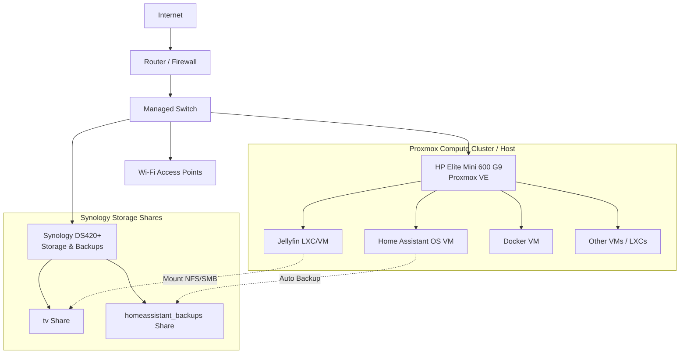

# Homelab Architecture

This document describes the current architecture and long-term vision for the homelab.

---

## Overview

The setup starts with low-cost components and evolves over time. The primary objective is to maintain reliable core services (such as Home Assistant) while separating compute and storage duties.

### Component Roles

| Component | Hardware | Role |
| --- | --- | --- |
| **Compute** | HP Elite Mini 600 G9 | Hypervisor (Proxmox VE) for VMs & LXC containers |
| **Storage** | Synology DS420+ | Bulk media storage, backups, network storage |
| **Virtualization** | Proxmox VE | Central virtualization platform on HP Mini |
| **Networking** | TP-Link Archer C2300-class + 8-port Switch | Initially Gigabit, transitioning to managed 2.5/10 GbE |
| **Smart Home** | Home Assistant OS | Virtual machine running Home Assistant OS |

---

## Target Long-Term Architecture

---

## Design Principles

See [AGENTS.md](../AGENTS.md#guiding-principles) for the canonical list of guiding principles.
