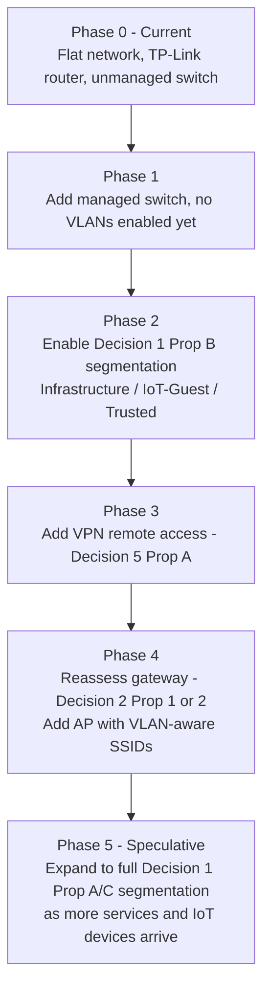

# Network Strategy

This document lays out strategic options for evolving the network beyond the current flat topology described in [hardware/networking.md](../hardware/networking.md). It is a planning document, not a build spec: it presents multiple propositions per decision point so a direction can be chosen deliberately, rather than defaulting to whatever was written down first.

Per [AGENTS.md](../AGENTS.md#guiding-principles), VLANs are introduced only when the network is ready for the added complexity, and migrations should be reversible. Nothing here is committed until it appears as "Current State" in [hardware/networking.md](../hardware/networking.md).

---

## Current State (baseline)

- Flat, unmanaged network: TP-Link Archer C2300-class router + 8-port unmanaged switch.
- Router is itself behind an upstream ISP router/ONT (double-NAT); see [hardware/networking.md](../hardware/networking.md) for the observed WAN/LAN configuration.
- No VLANs, no PoE, no dedicated firewall.
- All devices (Proxmox host, Synology, clients) share a single broadcast domain.

This is adequate today because host count and trust requirements are low. The propositions below become relevant as more services (Home Assistant, Jellyfin, IoT devices) go live.

---

## Decision 1: Segmentation Model

### Proposition A — Five-VLAN model (as currently sketched in hardware/networking.md)

Matches the existing proposed layout: Management, Servers, IoT, Trusted, Guest.

| VLAN ID | Name | Purpose |
| --- | --- | --- |
| 10 | Management | Proxmox, Synology DSM, switches, UPS/PDU |
| 20 | Servers | Jellyfin, Docker hosts, application services |
| 30 | IoT | Smart home devices, Zigbee bridges, Wi-Fi IoT |
| 40 | Trusted | Personal PCs, laptops, phones |
| 50 | Guest | Guest Wi-Fi |

- **Pros**: Clear separation between infrastructure, services, IoT, and people. Matches common homelab/UniFi reference designs, so it's easy to find guides and troubleshoot.
- **Cons**: Five VLANs means five sets of firewall rules to get right before anything can talk to anything else (e.g. Trusted → Servers for Jellyfin, Trusted → Management for Proxmox UI). More complexity to configure and maintain than the current single-host homelab strictly needs today.

### Proposition B — Three-tier model (simplified)

Collapse Management into Servers (both are "infrastructure you trust"), and keep IoT and Guest separate since those hold genuinely different trust levels.

| VLAN ID | Name | Purpose |
| --- | --- | --- |
| 10 | Infrastructure | Proxmox, Synology, switches, Jellyfin, Docker hosts, all "your" services |
| 30 | IoT/Guest-untrusted | Smart home + guest Wi-Fi, isolated from Infrastructure |
| 40 | Trusted | Personal devices |

- **Pros**: Fewer inter-VLAN rules to write and audit; faster to actually deploy; still solves the main risk (IoT/guest devices reaching the NAS or Proxmox management UI).
- **Cons**: No isolation between the Proxmox/Synology management plane and the services running on top of them — a compromised container on the Servers tier sits on the same L2 segment as DSM and the Proxmox API. Less room to grow without a renumbering later.

### Proposition C — Six-plus VLAN model (future-proofed)

Splits Proposition A further: separate wired IoT (e.g. cameras) from wireless IoT, and add a dedicated VLAN for anything internet-facing (reverse proxy, VPN endpoint).

| VLAN ID | Name | Purpose |
| --- | --- | --- |
| 10 | Management | Proxmox, DSM, switches, UPS/PDU |
| 20 | Servers | Jellyfin, Docker hosts, internal services |
| 25 | DMZ | Reverse proxy / VPN endpoint exposed to the internet |
| 30 | IoT-Wireless | Wi-Fi smart home devices |
| 31 | IoT-Wired | Zigbee/Z-Wave bridges, cameras, PoE sensors |
| 40 | Trusted | Personal devices |
| 50 | Guest | Guest Wi-Fi |

- **Pros**: A compromised IoT device or an internet-facing service is contained furthest from Management and from each other. Matches where the homelab is heading long-term (Jellyfin possibly remote-accessible, cameras planned).
- **Cons**: Meaningfully more firewall rules and subnets to track for a single-host setup; probably premature until there's more than one physical switch and an AP that supports SSID-to-VLAN tagging.

**Recommendation for sequencing**: adopt Proposition B first as an actually-achievable milestone, and treat Propositions A/C as the target to grow into once a managed switch and real AP exist — this keeps the "introduce VLANs only when ready" principle intact instead of designing five VLANs' worth of rules against one unmanaged switch.

---

## Decision 2: Routing / Firewall Hardware

### Proposition 1 — UniFi ecosystem (Gateway + Switch + AP)

Adopt UniFi end-to-end: UniFi Gateway (e.g. Cloud Gateway or Dream Machine class device) replacing the TP-Link router, paired with a UniFi managed switch and UniFi AP.

- **Pros**: Single management UI for routing, VLANs, firewall rules, and Wi-Fi. Well-documented for homelab VLAN setups. Matches the "managed UniFi ecosystem" direction already noted in hardware/networking.md.
- **Cons**: Vendor lock-in to UniFi's controller model; controller itself becomes something to host/back up (or relies on cloud). Highest cost of the three options if starting from zero.

### Proposition 2 — Dedicated firewall VM/appliance (pfSense/OPNsense) + independent managed switch

Run pfSense or OPNsense as a VM on the existing Proxmox host (or a small dedicated appliance) as the router/firewall, paired with any VLAN-capable managed switch (not necessarily UniFi) and any VLAN-aware AP.

- **Pros**: No vendor lock-in, mix-and-match hardware, more advanced firewall/IDS features than most consumer gateways, keeps hardware spend flexible. Fits "Proxmox as the central virtualization layer" principle since the firewall becomes a VM alongside everything else.
- **Cons**: Routing for the whole network now depends on the Proxmox host staying up — a hypervisor reboot takes down internet access, which is a bigger blast radius than today. Needs a NIC/VLAN-trunk plan on the host itself, and more manual configuration than a turnkey gateway.

### Proposition 3 — Incremental: keep TP-Link router, add only a managed switch

Leave the TP-Link Archer C2300-class router as the internet-facing router (or flash it to OpenWrt firmware, if this model is supported, for VLAN tagging support), and introduce a budget VLAN-capable managed switch as the only new purchase. VLANs terminate at the switch/router; no dedicated firewall appliance yet.

- **Pros**: Lowest cost, smallest step, avoids the "avoid recommending new hardware unless there is a clear need" principle being violated. Good first move to validate whether VLANs are actually needed before buying a gateway.
- **Cons**: Consumer router firmware has limited inter-VLAN firewall rule granularity (stock TP-Link firmware in particular); real isolation between VLANs may not be enforceable until a proper firewall is added later, so this is a stepping stone, not an end state. Also doesn't resolve the existing double-NAT hop behind the upstream ISP router/ONT.

**Recommendation for sequencing**: Proposition 3 as the next concrete step (buy a managed switch, prove out VLANs 10/20/30-ish on paper), then reassess between Propositions 1 and 2 once there's a real workload reason (e.g. wanting IDS/IPS, or wanting a unified controller for a growing number of APs/cameras).

---

## Decision 3: Wireless Strategy

### Proposition A — Single multi-SSID AP

One access point broadcasting multiple SSIDs (Trusted, IoT, Guest), each mapped to its VLAN. Matches a home with one floor/small footprint.

- **Pros**: Cheapest, simplest to manage, sufficient coverage for a typical apartment/small house.
- **Cons**: Single point of failure for all wireless traffic; no roaming if the home grows.

### Proposition B — Multiple APs with a controller

Two or more APs (UniFi or otherwise) under a shared controller for roaming and consistent SSID-to-VLAN mapping across the whole space.

- **Pros**: Better coverage and roaming; centralized SSID/VLAN policy.
- **Cons**: Only worth it once physical coverage is actually a problem — otherwise it's added cost and a controller to maintain for no measurable benefit today.

**Recommendation**: defer this decision — it depends on physical coverage needs, not on the VLAN/router decisions above. Revisit once Decision 2 is settled and an AP with VLAN/SSID tagging is in scope anyway.

---

## Decision 4: DNS / DHCP Placement

### Proposition A — Router/gateway handles DHCP and DNS (status quo)

Keep DHCP and DNS on whatever device is playing router (TP-Link, UniFi Gateway, or pfSense/OPNsense).

- **Pros**: Simplest, no extra service to keep available; DHCP/DNS survive a Proxmox reboot.
- **Cons**: No ad-blocking/query logging beyond what the router firmware offers.

### Proposition B — AdGuard Home (or Pi-hole) as DNS, router keeps DHCP

Deploy AdGuard Home as an LXC/VM on Proxmox (already tracked as "Planned" in [services/README.md](../services/README.md#service-status-matrix)) for DNS filtering, while DHCP stays on the router/gateway pointing clients at it.

- **Pros**: Network-wide ad/tracker blocking without taking DHCP availability risk; matches the already-planned service.
- **Cons**: Adds a soft dependency — if the AdGuard VM is down, DNS resolution degrades for the network unless a fallback resolver is configured on clients/router.

### Proposition C — AdGuard Home handles both DHCP and DNS

Move DHCP itself onto the AdGuard Home instance for tighter integration between DHCP leases and DNS records (per-client filtering, hostnames in the UI).

- **Pros**: Best UX for per-device policy and visibility.
- **Cons**: Now the Proxmox host being down breaks new devices getting an IP address at all — a meaningful availability regression for a homelab whose router should be the most boring, reliable part of the stack.

**Recommendation**: Proposition B — get the filtering benefit without making core network availability depend on the hypervisor.

---

## Decision 5: Remote Access

### Proposition A — WireGuard/Tailscale overlay network

Run a WireGuard-based VPN (self-hosted, or Tailscale/Headscale for easier NAT traversal and device management) to reach internal services (Jellyfin, Proxmox UI, Home Assistant) from outside without exposing anything directly to the internet.

- **Pros**: No inbound ports opened on the router; strong default security posture; works well with the DMZ concept in Segmentation Proposition C if adopted later.
- **Cons**: Requires a client installed on every remote device; slightly more setup than a plain port-forward.

### Proposition B — Reverse proxy with selective exposure

Run a reverse proxy (e.g. Caddy/Traefik/Nginx Proxy Manager) on a DMZ-style network segment, exposing only specific services (e.g. Jellyfin) to the internet behind TLS and authentication.

- **Pros**: No VPN client needed for casual use (e.g. sharing Jellyfin with family); familiar pattern for self-hosted services.
- **Cons**: Directly increases attack surface — anything exposed here needs to be kept patched and monitored, which is more ongoing operational burden than a VPN-only approach.

**Recommendation**: Proposition A (VPN-only) as the default; consider Proposition B later, and only for specific low-risk services, if VPN-only proves inconvenient for non-technical household members.

---

## Suggested Phased Rollout

Each phase should be individually reversible: stop after any phase and the network is still fully functional, which keeps this migration-friendly per [AGENTS.md](../AGENTS.md#guiding-principles).

---

## Open Questions / Explicitly Not Decided Here

- Actual subnet ranges, VLAN-to-subnet mapping, and hostnames are intentionally left as placeholders (`TBD`) — these should be assigned at implementation time, not speculated in a strategy doc, per [AGENTS.md](../AGENTS.md#implementation-standards).
- Specific hardware SKUs (which UniFi Gateway model, which managed switch) are out of scope here; that belongs in [hardware/networking.md](../hardware/networking.md) once a Decision 2 proposition is chosen.
- Firewall rule sets between VLANs (what's allowed to talk to what) should be documented once a segmentation model is chosen, not before.
