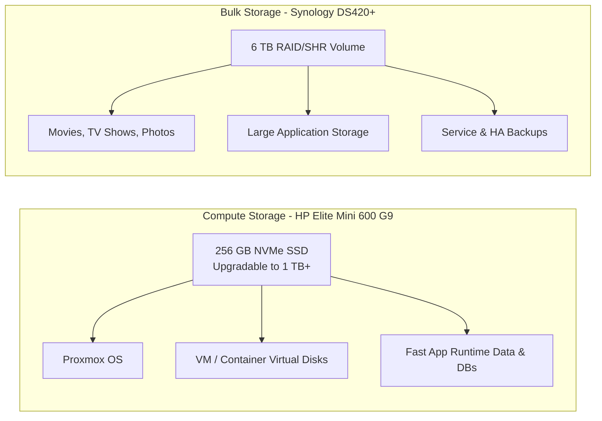
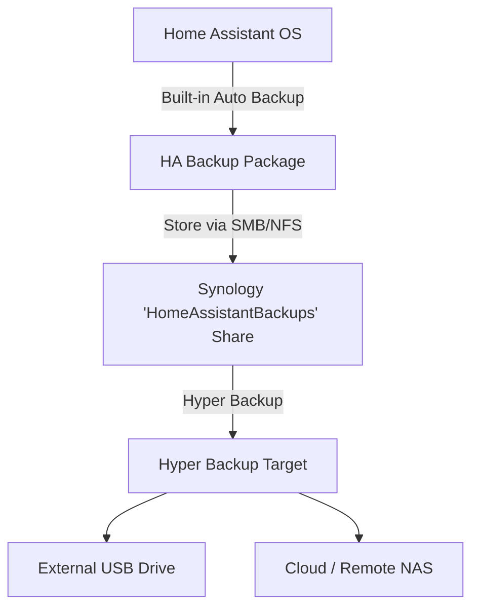
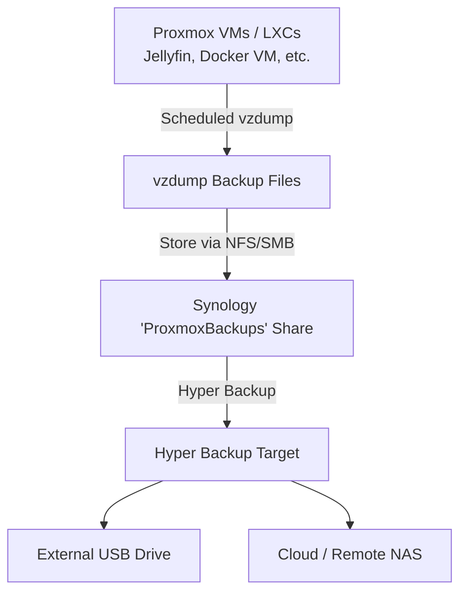

# Storage Strategy

This document outlines the allocation of storage and backup workflows across the homelab infrastructure.

---

## Workload Allocation

### 1. Compute Node (HP Elite Mini 600 G9)
- **Current**: 256 GB NVMe SSD.
- **Future Upgrade**: Expand to 1 TB or 2 TB+ NVMe SSD (plus potential secondary NVMe).
- **Purpose**: Fast local storage for Proxmox OS, VM/LXC virtual disks, databases, system logs, and Proxmox snapshots.

### 2. NAS (Synology DS420+)
- **Current**: 6 TB volume hosting media files and temporary Home Assistant VM storage.
- **Future Role**: Pure NAS dedicated to bulk media (movies, TV shows, photos), central backup target, and network storage shares (NFS/SMB).

---

## Backup Strategy

To ensure seamless disaster recovery, application-level backups are decoupled from hypervisor VM disk images.

### Key Backup Rules
- **Application-Level Backups**: Use Home Assistant's built-in backup engine to generate full system backups automatically.
- **Synology Shared Folder**: Store backups in a dedicated share named `HomeAssistantBackups`.
- **Synology Dedicated User**: Access restricted to a dedicated user `ha-backup`.
- **Secondary Backup (Hyper Backup)**: Back up the `.tar` backup files from Synology to external media or offsite cloud storage. Do *not* rely solely on VM image snapshots.

---

## General VM/LXC Backup Strategy

Home Assistant's backup approach above is deliberately different from a generic VM backup: it is application-level and portable, which matters because Home Assistant is safety-relevant. Other services don't share that constraint, so they follow a staged approach instead.

### Baseline: Proxmox vzdump

Until a service has a proven need for something better, every VM/LXC other than Home Assistant is protected by Proxmox's built-in `vzdump`, scheduled and targeted at a Synology share.

- **Scope**: whole VM/LXC disk and config snapshot. Crash-consistent, not application-consistent.
- **Target**: dedicated `ProxmoxBackups` share on the Synology DS420+, separate from `HomeAssistantBackups`.
- **Secondary backup**: reuse the existing Hyper Backup path to external/offsite storage rather than introducing a second mechanism.

### Upgrading to App-Level Backups

`vzdump` is a safety net, not the end state. As each planned service is actually deployed, evaluate whether it warrants an app-level backup instead of, or alongside, `vzdump`, based on what the application supports:

| Service | Native Backup Support | Recommended Approach |
| --- | --- | --- |
| **Paperless-ngx** | `document_exporter` / `document_importer` (full portable export) | App-level export, same pattern as Home Assistant |
| **Immich** | `pg_dump` / `pg_dumpall` for metadata only | DB dump plus filesystem sync of the library folder |
| **Jellyfin** | No native export; media already lives on the NAS | Periodic copy of the config/DB directory only |
| **Docker VM, MQTT, AdGuard Home, etc.** | No native export | `vzdump` baseline is sufficient |

This table is not a commitment to build these integrations now. It exists so that when a service moves from "Planned" to "Deployed" in [services/README.md](../services/README.md), its backup method is a deliberate choice rather than an afterthought.
