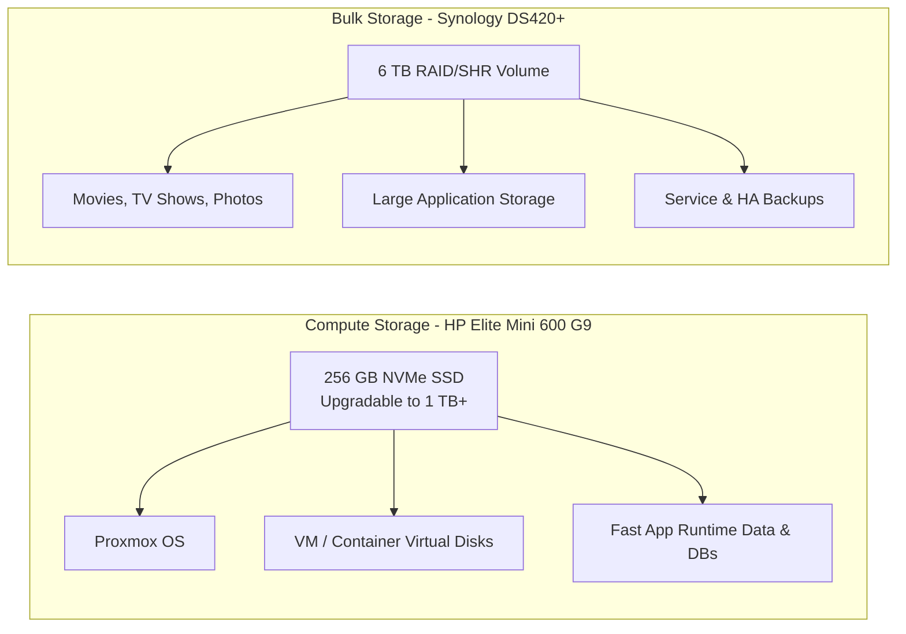
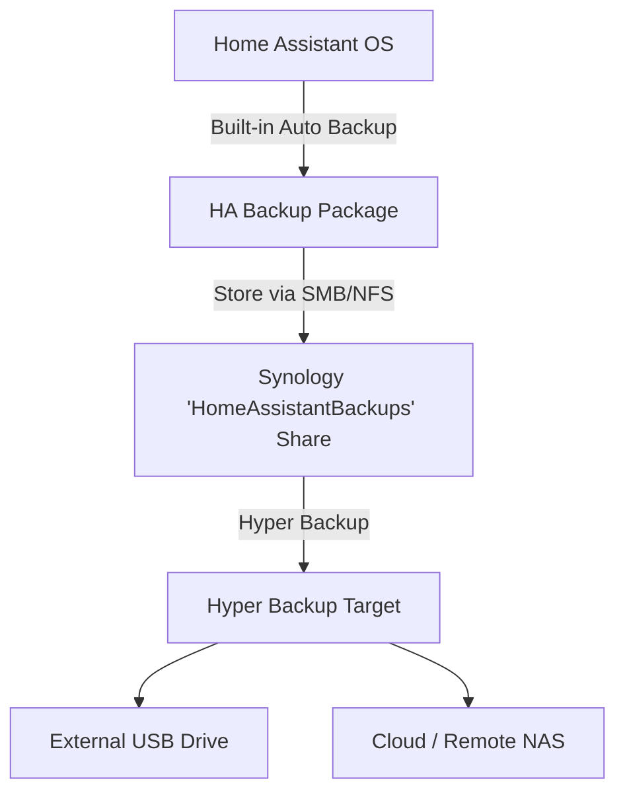

# Storage Strategy

This document outlines the allocation of storage and backup workflows across the homelab infrastructure.

---

## Workload Allocation

### 1. Compute Node (HP Elite Mini 600 G9)
- **Current**: 256 GB NVMe SSD.
- **Future Upgrade**: Expand to 1 TB or 2 TB+ NVMe SSD (plus potential secondary NVMe).
- **Purpose**: Fast local storage for Proxmox OS, VM/LXC virtual disks, databases, system logs, and Proxmox snapshots.

### 2. NAS (Synology DS420+)
- **Current**: 6 TB volume hosting media files and temporary Home Assistant VM storage.
- **Future Role**: Pure NAS dedicated to bulk media (movies, TV shows, photos), central backup target, and network storage shares (NFS/SMB).

---

## Backup Strategy

To ensure seamless disaster recovery, application-level backups are decoupled from hypervisor VM disk images.

### Key Backup Rules
- **Application-Level Backups**: Use Home Assistant's built-in backup engine to generate full system backups automatically.
- **Synology Shared Folder**: Store backups in a dedicated share named `HomeAssistantBackups`.
- **Synology Dedicated User**: Access restricted to a dedicated user `ha-backup`.
- **Secondary Backup (Hyper Backup)**: Back up the `.tar` backup files from Synology to external media or offsite cloud storage. Do *not* rely solely on VM image snapshots.
