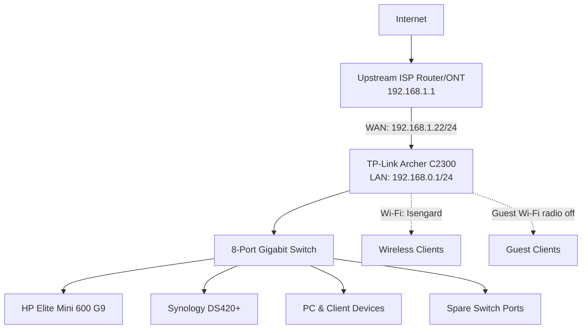

# Networking Infrastructure

This document details the current topology and future network design. For a broader discussion of alternative segmentation models, gateway options, and rollout sequencing, see [docs/network-strategy.md](../docs/network-strategy.md).

---

## Current Topology

### Current Components
- **ISP Router**: Model unknown/not tracked. Provided by the ISP solely to hand internet access to the TP-Link router's WAN port (192.168.1.1 side of the double-NAT). Not otherwise managed or configured as part of this homelab.
- **Router**: TP-Link Archer C2300-class (AC2300 tier)
- **Switch**: 8-Port Unmanaged Gigabit Ethernet Switch

### Router Configuration (as observed)

| Interface | Setting | Value |
| --- | --- | --- |
| WAN | IP Address | 192.168.1.22 |
| WAN | Subnet Mask | 255.255.255.0 |
| WAN | Default Gateway | 192.168.1.1 (ISP router — see Current Components above) |
| WAN | Connection Type | Dynamic IP |
| LAN | IP Address | 192.168.0.1 |
| LAN | Subnet Mask | 255.255.255.0 |
| LAN | DHCP Server | Enabled |
| LAN | DHCP Pool | 192.168.0.100 – 192.168.0.249 |
| LAN | Lease Time | 120 minutes |
| LAN | Address Reservations | None configured on the router — static assignments below are set device-side instead |
| Wireless (2.4G/5G) | SSID | `Isengard` |
| Wireless (2.4G/5G) | Mode | 802.11b/g/n mixed |
| Wireless (2.4G) | Channel | Auto (currently channel 2) |
| Guest Network | SSID | `TP-Link_Guest_CD61` |
| Guest Network | Wireless Radio | Off (not currently in use) |
| Guest Network | Client Isolation | "Allow Guests to Access Each Other" — Off |

### Static IP Assignments

Devices below `.100` are outside the router's DHCP pool (`192.168.0.100`–`192.168.0.249`) and are configured with a static IP directly on the device rather than via a router-side DHCP reservation.

Within that `.1`–`.99` static range, a sub-range convention keeps assignments organized ahead of eventual VLAN segmentation:

| Range | Purpose | Maps to (future) |
| --- | --- | --- |
| `.2`–`.29` | Core infrastructure (hypervisor, NAS, network gear) | VLAN 10 — Management |
| `.30`–`.99` | Individual services/apps hosted on Proxmox (LXCs/VMs) | VLAN 20 — Servers |

| Device | IP Address | Configured Via |
| --- | --- | --- |
| HP Elite Mini 600 G9 (Proxmox) | 192.168.0.2 | Proxmox host network config (see [hardware/compute.md](compute.md#network-configuration)) |
| Synology DS420+ | 192.168.0.10 | DSM → Control Panel → Network (see [hardware/storage.md](storage.md#network-configuration)) |
| Jellyfin LXC (CT 100) | 192.168.0.30 | Proxmox VE Advanced Settings during LXC creation (see [services/jellyfin/README.md](../services/jellyfin/README.md)) |

---

## Future Network Roadmap

Segmentation model, gateway/firewall hardware, wireless strategy, DNS/DHCP placement, and remote access are all still open decisions with multiple viable options and explicit trade-offs — see [docs/network-strategy.md](../docs/network-strategy.md) for the full set of propositions and the recommended sequencing. Nothing there is committed until it is reflected in the "Current Topology" section above.
