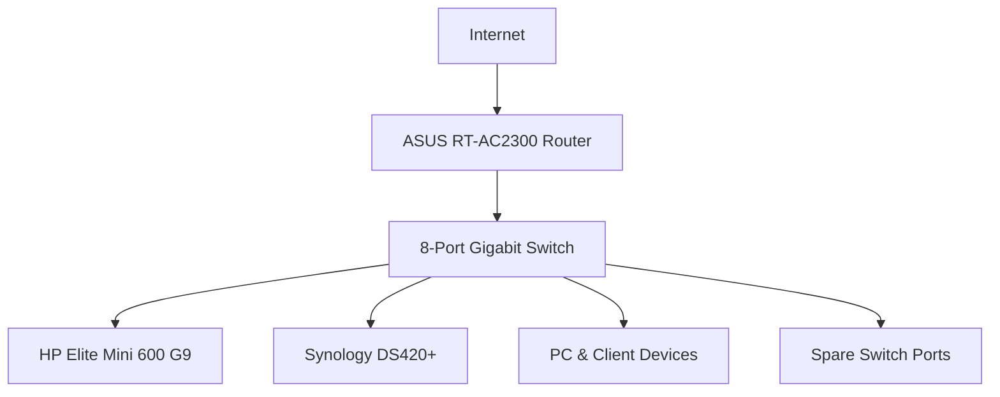

# Networking Infrastructure

This document details the current topology and future network design.

---

## Current Topology

### Current Components
- **Router**: ASUS RT-AC2300
- **Switch**: 8-Port Unmanaged Gigabit Ethernet Switch

---

## Future Network Roadmap

As homelab demands expand, the networking infrastructure will upgrade to a managed UniFi ecosystem with VLAN isolation and PoE support.

### Proposed VLAN Layout

| VLAN ID | Name | Subnet / Scope | Devices / Purpose |
| --- | --- | --- | --- |
| **VLAN 10** | Management | TBD | Proxmox PVE, Synology DSM, Network Switches, PDU/UPS |
| **VLAN 20** | Servers | TBD | Jellyfin, Docker hosts, application services |
| **VLAN 30** | IoT | TBD | Smart home devices, Zigbee bridges, Wi-Fi IoT |
| **VLAN 40** | Trusted | TBD | Primary PCs, laptops, personal mobile devices |
| **VLAN 50** | Guest | TBD | Guest Wi-Fi clients |

### Planned Hardware Upgrades
- **Managed Switch**: Managed switch with VLAN support and PoE capabilities.
- **High-Speed Uplinks**: Upgrade key interconnects to 2.5 GbE or 10 GbE.
- **Dedicated Router/Firewall**: UniFi Gateway or dedicated firewall.
- **PoE Devices**: Power Access Points (APs), IP cameras, and small hardware appliances over Ethernet.
