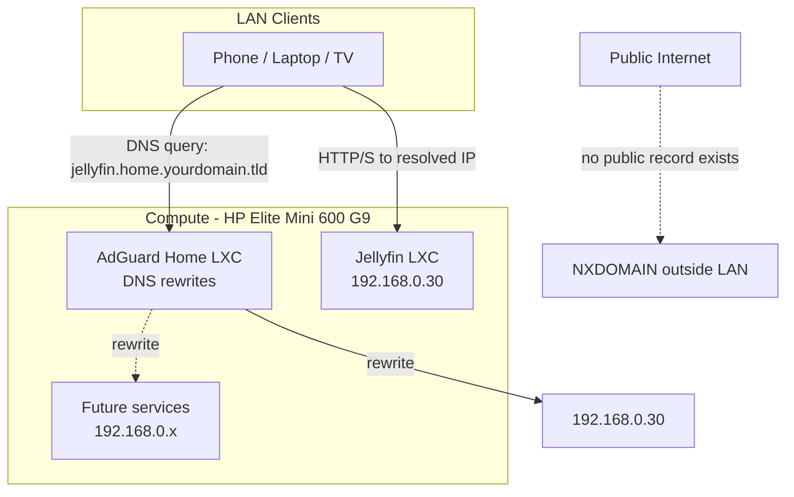

# AdGuard Home

AdGuard Home is the planned local DNS server for the homelab. Its primary purpose here is **name-based access to internal services** (e.g. `jellyfin.home.yourdomain.tld` instead of `192.168.0.30`) via DNS rewrites, with network-wide ad/tracker blocking as a secondary benefit. This is Decision 4, Proposition B in [docs/network-strategy.md](../../docs/network-strategy.md#decision-4-dns--dhcp-placement).

**Status**: Planned. Not yet deployed.

---

## Architecture Plan

Resolution only happens for clients pointed at AdGuard Home (i.e. on the LAN). No public DNS record is created for these names, so the same hostnames simply fail to resolve from outside the network — this is what keeps the setup LAN-only despite using a real, owned domain. This is unrelated to Decision 5 (Remote Access) in network-strategy.md, which is still undecided and not implemented.

---

## Split-Horizon DNS Plan

- **Domain**: a personal domain the user owns (placeholder: `yourdomain.tld` — actual domain intentionally not recorded here per [AGENTS.md](../../AGENTS.md#implementation-standards), to be filled in at implementation time).
- **Dedicated internal subdomain**: `home.yourdomain.tld`, rather than rewriting names directly under the bare domain. Chosen so that anything under `home.*` is unambiguously LAN-only/internal, and can never be confused with or accidentally collide with a real public record later added on the root domain (e.g. a personal website or email).
- **Naming convention**: `<service>.home.yourdomain.tld`, e.g. `jellyfin.home.yourdomain.tld`.
- **Where this lives**: purely as DNS rewrites inside AdGuard Home's config — no registrar-side DNS record is created or needed for this to work.

---

## Deployment Specs

- **Host Platform**: Proxmox VE on HP Elite Mini 600 G9 — keeps DNS on the same central virtualization layer as other services, per [AGENTS.md](../../AGENTS.md#guiding-principles).
- **Deployment Type**: LXC (undecided whether privileged/unprivileged — TBD at implementation time). A VM was not considered necessary; AdGuard Home is a single lightweight process, matching the reasoning already used for Jellyfin.
- **Provisioning Method**: TBD. The [community-scripts.org](https://community-scripts.github.io/ProxmoxVE/) AdGuard Home LXC script is the likely candidate, following the same precedent as the Jellyfin deployment, but this hasn't been decided.
- **Network**: Static IP TBD — next available address in the `.30`–`.99` service range per [hardware/networking.md](../../hardware/networking.md#static-ip-assignments). Not assigned here; do not invent one per [AGENTS.md](../../AGENTS.md#implementation-standards).
- **Network Ports**:
  | Port | Protocol | Purpose |
  | --- | --- | --- |
  | 53 | TCP/UDP | DNS resolution — the actual service this exists for |
  | 3000 | TCP | Initial setup wizard (first run only) |
  | 80 (or custom) | TCP | Admin web UI, after initial setup |
- **Backup Approach**: `AdGuardHome.yaml` (config + DNS rewrites + filter lists) backed up alongside the baseline `vzdump` schedule targeting the Synology `proxmox_backups` share, same pattern as [services/proxmox.md](../proxmox.md#storage-configuration).
- **Dependencies**:
  - Synology/Proxmox network path (no VLAN dependency at this stage, same as Jellyfin).
  - **Router DHCP "DNS Server" setting** must be changed to point at AdGuard Home's static IP so LAN clients actually use it. This is a live DNS/DHCP behavior change — per [AGENTS.md Safety Rules](../../AGENTS.md#safety-rules), this requires explicit confirmation before being made, and should not be done as part of just standing up the LXC.
  - A fallback DNS resolver should be configured on clients/router, since (per Decision 4's documented trade-off) AdGuard Home being down would otherwise degrade DNS for the whole LAN.

---

## Deployment Steps

1. Provision the AdGuard Home LXC on Proxmox VE (method TBD — see Deployment Specs).
2. Assign a static IP in the `.30`–`.99` service range.
3. Complete the AdGuard Home setup wizard; set the admin web UI port.
4. Add DNS rewrites for each existing service under `home.yourdomain.tld` (starting with Jellyfin at its current static IP).
5. **Ask before proceeding**: update the router's DHCP "DNS Server" setting to point LAN clients at the AdGuard Home LXC, with a fallback resolver configured.
6. Verify name resolution and ad-blocking from a LAN client.
7. Confirm the same hostnames do **not** resolve from outside the LAN (no public record exists) — this validates the split-horizon boundary before trusting it.

---

## Future Work: HTTPS for Internally-Named Services

Currently out of scope — Jellyfin is the only deployed service and is accessed over plain HTTP on the LAN, so there's no immediate need. Documented here as the plan to revisit once more name-based services exist and a real TLS certificate becomes worth the setup:

- Because the domain is genuinely owned, a publicly-trusted Let's Encrypt certificate (e.g. a wildcard `*.home.yourdomain.tld`) can be issued via the **DNS-01 challenge** — this only requires adding a short-lived TXT record through the domain's DNS provider API, and does **not** require exposing any port or making the service reachable from the internet. It stays fully compatible with the LAN-only, no-public-record setup above.
- This requires a reverse proxy (e.g. Caddy or Traefik) in front of internal services to actually terminate TLS with the issued certificate — not needed while there is only one HTTP service, but worth revisiting once several exist behind name-based access.
- The DNS provider API token needed for the DNS-01 challenge must never be committed to this repo — follow [AGENTS.md](../../AGENTS.md#implementation-standards): use a `.env.example` placeholder file, with the real token kept outside version control.
- This remains entirely independent of Decision 5 (Remote Access) in network-strategy.md — it's about getting a trusted padlock for LAN-only traffic, not about making anything internet-reachable.
