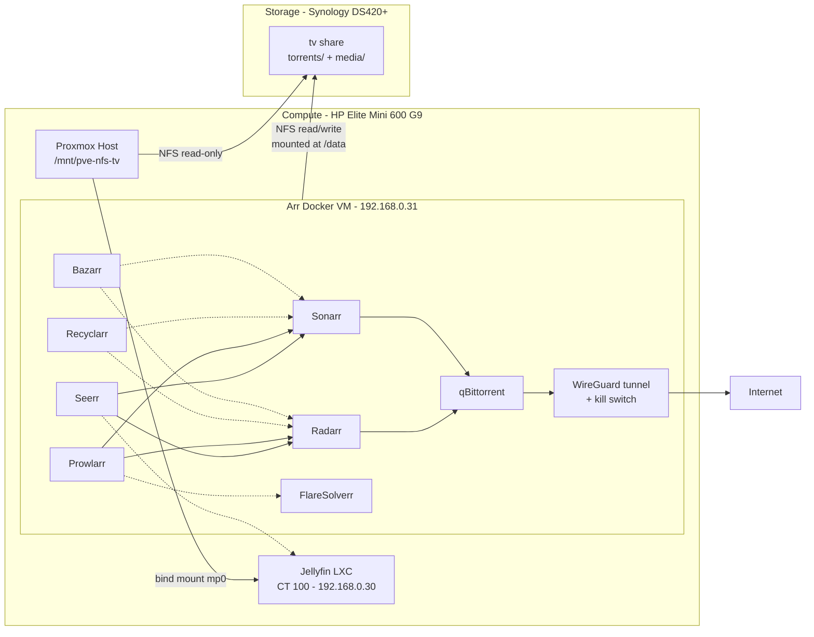

# Arr Stack (Media Automation)

The arr stack automates finding, downloading, renaming, and filing movies and TV shows into the media library that Jellyfin already serves. It is treated as **one logical service** made of tightly coupled apps: they share a single filesystem (required for hardlinks), talk to each other over API keys, and are deployed and updated together.

**Status**: Planned. Not yet deployed. All design decisions are made, including the VPN provider (Proton VPN) — see [Decision Log](#decision-log).

**Reference setup**: [automation-avenue/arr-new](https://github.com/automation-avenue/arr-new) — a single `docker-compose.yml` following the [TRaSH Guides](https://trash-guides.info/File-and-Folder-Structure/How-to-set-up/Docker/) folder layout. Used as a starting point, not copied as-is; see [Deviations from the Reference Setup](#deviations-from-the-reference-setup).

**Config files**: [docker-compose.yml](docker-compose.yml) and [.env.example](.env.example), both next to this file. The real `.env` and all app data stay on the VM only.

---

## Components

| App | Role | Port | Access to `/data` |
| --- | --- | --- | --- |
| **Prowlarr** | Indexer manager — configures indexers once and syncs them to Radarr/Sonarr | 9696/tcp | None |
| **Radarr** | Movie automation — searches, grabs, imports, renames | 7878/tcp | Read/write |
| **Sonarr** | TV automation — same role as Radarr for series | 8989/tcp | Read/write |
| **qBittorrent** | Torrent download client, all traffic through a WireGuard VPN | 8080/tcp (Web UI) | Read/write |
| **Bazarr** | Subtitle download for Radarr/Sonarr libraries | 6767/tcp | `media/` only |
| **Seerr** | Request page — family members request movies/shows with their Jellyfin accounts | 5055/tcp | None |
| **FlareSolverr** | Cloudflare challenge solver, used by Prowlarr only for indexers that need it | 8191/tcp (Docker network only) | None |
| **Recyclarr** | Syncs TRaSH Guides quality profiles and custom formats into Radarr/Sonarr on a schedule | — (no UI) | None |

**Not included**:
- **Jellyfin**: already deployed as its own LXC (CT 100) and stays there — see [services/jellyfin/README.md](../jellyfin/README.md). The arr stack only writes files into the library; Jellyfin reads them.
- **Lidarr** (music): not needed for now. Can be added later with `torrents/music` + `media/music` folders.

**Seerr vs Jellyseerr**: Jellyseerr and Overseerr merged into [Seerr](https://docs.seerr.dev/blog/seerr-release/) in February 2026. Jellyseerr no longer exists as a separate project, so Seerr (`ghcr.io/seerr-team/seerr`) is used instead.

---

## Architecture Plan



### Why a VM instead of LXCs

Chosen over three alternatives (one LXC per app, Docker inside an LXC, Synology Container Manager). The deciding factors:

- **NFS mounting**: unprivileged LXCs cannot mount NFS (kernel restriction, discovered during the Jellyfin deployment — see [services/proxmox.md](../proxmox.md#service-level-storage-media-app-data)). A VM mounts NFS itself, so the host-mount-plus-bind-mount workaround isn't needed.
- **UID mapping**: the arr apps **write** to the NAS. In an unprivileged LXC, container UIDs are shifted to ~100000+ on the host, which doesn't match any Synology user. A VM has no UID shift, so the container `PUID` can match a real Synology account directly.
- **Fits the reference setup**: the compose file transfers almost unchanged, and apps reach each other by container name (`http://radarr:7878`) on a private Docker network instead of each needing its own static IP.
- **VPN containment**: the VPN tunnel and its kill switch live entirely inside the VM.

**Accepted trade-offs**: ~2–4 GB RAM and a little VM overhead; and this is the first "shared container host" on Proxmox, which is an explicit, documented exception to the one-LXC/VM-per-service rule in [services/proxmox.md](../proxmox.md#hosted-workloads) — justified because the stack is one logical service.

---

## Storage Plan

### Hardlinks: the constraint that drives the layout

Radarr/Sonarr import a finished download into the library by **hardlinking** it rather than copying it. The file then exists once on disk while qBittorrent continues seeding from `torrents/` and Jellyfin plays it from `media/`. This only works if both folders are on **the same filesystem**, which here means:

- **Same Synology shared folder** — each shared folder is a separate Btrfs subvolume, and hardlinks cannot cross subvolumes.
- **One NFS mount** inside the VM — hardlinks cannot cross separate mounts, even if they point to the same NAS.

If this is misconfigured, imports silently fall back to **copying**, doubling disk usage for everything still seeding. This matters because Volume 1 is already ~80% full (see [hardware/storage.md](../../hardware/storage.md#storage-pool--volume)).

### Folder layout (inside the existing `tv` share)

The existing `tv` share is reused (see [Decision Log](#decision-log)). Its current top-level folders `movies/` and `shows/` move under a new `media/` folder, and a `torrents/` folder is added next to it:

```text
tv/                         (Synology shared folder, /volume1/tv)
├── torrents/               NEW — qBittorrent download location
│   ├── movies/             category "movies" (Radarr)
│   └── shows/              category "shows" (Sonarr)
└── media/                  NEW — library root
    ├── movies/             moved from tv/movies  → Radarr root folder
    └── shows/              moved from tv/shows   → Sonarr root folder
```

- **Moves are instant**: moving `movies/` and `shows/` within the same shared folder is a rename, not a copy, so it doesn't need free space or time.
- **`shows` rather than TRaSH's `tv`**: keeps the existing folder name and avoids a confusing `tv/media/tv` path.
- Mounted in the VM at `/data`, and passed into every container that needs it as `/data:/data` (same path inside and outside the container, so the paths qBittorrent reports match what Radarr/Sonarr see).

### Impact on Jellyfin (CT 100)

- **No change to the mount**: CT 100 keeps seeing the whole share at `/mnt/tv` through the same host mount and `mp0`.
- **Library paths change**: `/mnt/tv/movies` → `/mnt/tv/media/movies` and `/mnt/tv/shows` → `/mnt/tv/media/shows`. The two Jellyfin libraries are re-created pointing at the new paths.
- **Watched status and metadata may reset**, because Jellyfin identifies items by file path. Radarr/Sonarr renaming files on import would change paths anyway, so the move and the renaming are done together so that Jellyfin only re-identifies the library once.
- Jellyfin also sees `/mnt/tv/torrents/` (read-only). This is harmless; it is simply not added as a library.

### NFS exports on the `tv` share

| Client | Access | Squash | Purpose |
| --- | --- | --- | --- |
| Arr Docker VM (`192.168.0.31`) | **Read/Write** | **No mapping** | Downloads, imports, renames — files owned by the `arr` DSM user |
| Proxmox host (`192.168.0.2`) | **Read-Only** (unchanged) | Map all users to admin (unchanged) | Host mount bind-passed into Jellyfin CT 100 |

Synology applies squash settings per NFS rule, so the new read/write rule doesn't affect the existing read-only one. Jellyfin keeps read-only access; only the arr VM can write.

### File ownership: dedicated `arr` DSM user

- A dedicated DSM user `arr` is created with **Read/Write** on the `tv` share only and no other share access (same least-privilege pattern as `ha-backup` — see [hardware/storage.md](../../hardware/storage.md#access-control--security)). Its DSM applications (File Station, SMB, etc.) can be denied, since it is only used over NFS.
- With **No mapping**, NFS passes the client's UID/GID through unchanged, so the containers must run as that same UID. `PUID`/`PGID` in `.env` are set to the `arr` account's UID and GID, read from DSM over SSH with `id arr` (this prints the account's numeric user ID and group memberships. DSM user IDs start at 1026, and the default `users` group is usually GID 100).
- `UMASK=002` makes new files group-writable, so every app can rename or clean up files written by the others.

### App configuration data (appdata)

Stored on the VM's own virtual disk (`vm-disks`, local SSD) under `/docker/appdata/<app>/`, **not** on the NAS. The arr apps use SQLite databases, which are unreliable over NFS (file locking issues can corrupt them). Protected by `vzdump` and each app's built-in backup — see [Backup Requirements](#backup-requirements).

### Capacity guardrails

The stack grows the library automatically on a volume DSM already flags as low. Configure from day one:

- Radarr/Sonarr **Minimum Free Space** (Settings → Media Management), so imports stop before the volume fills.
- qBittorrent **seeding limits** (ratio and/or time), so completed torrents that were never imported don't accumulate.
- Periodically check that hardlinks work (`ls -i` on the same file in `torrents/` and `media/` should show the same inode number).

---

## Deployment Specs

- **Host Platform**: Proxmox VE on HP Elite Mini 600 G9.
- **Deployment Type**: VM running Debian (current stable), with Docker Engine + Compose plugin from [Docker's official apt repository](https://docs.docker.com/engine/install/debian/) (Debian's own `docker.io` package lags behind and doesn't ship the Compose plugin).
- **Sizing**: 2 vCPU, 4 GB RAM, 32 GB disk on `vm-disks`. The apps are light; qBittorrent is the heaviest. Revisit if the library or torrent count grows large.
- **Provisioning Method**: manual Debian install from an ISO on `nas-images` (or a Debian cloud image with cloud-init), rather than an automated "Docker VM" script, so the Docker install stays visible and documented. Exact method chosen at implementation time.
- **Network**: static IP `192.168.0.31/24`, gateway `192.168.0.1` — next address in the `.30`–`.99` service range, see [hardware/networking.md](../../hardware/networking.md#static-ip-assignments).
- **NFS mount**: `tv` share mounted at `/data` in the VM via `/etc/fstab`.
- **Container images**: [hotio](https://hotio.dev/) images for the arr apps and qBittorrent (as in the reference setup), plus the official images for Seerr, FlareSolverr, and Recyclarr. **Every tag is pinned in `.env`** (the compose file refuses to start without them) and updated deliberately — the arr apps occasionally migrate their databases in ways that can't be rolled back.

### Network Ports

| Port | Protocol | Service | Exposure |
| --- | --- | --- | --- |
| 9696 | TCP | Prowlarr Web UI | LAN |
| 7878 | TCP | Radarr Web UI | LAN |
| 8989 | TCP | Sonarr Web UI | LAN |
| 8080 | TCP | qBittorrent Web UI | LAN |
| 6767 | TCP | Bazarr Web UI | LAN |
| 5055 | TCP | Seerr Web UI | LAN |
| 8191 | TCP | FlareSolverr | Docker network only — not published |
| *(torrent port)* | TCP/UDP | qBittorrent peer traffic | Through the VPN tunnel only — **no router port forward** |

Once AdGuard Home is deployed, these become name-based entries (`radarr.home.yourdomain.tld`, `requests.home.yourdomain.tld`, etc.) — see [services/adguard-home/README.md](../adguard-home/README.md).

### VPN (qBittorrent only)

qBittorrent uses hotio's built-in WireGuard support rather than a separate VPN container:

- `VPN_ENABLED=true` brings up the tunnel inside the qBittorrent container before qBittorrent starts. hotio's firewall rules act as the **kill switch**: if the tunnel is down, qBittorrent has no route to the internet.
- `VPN_LAN_NETWORK=192.168.0.0/24` allows LAN devices to reach the Web UI despite the firewall.
- `hostname: qbittorrent.internal` is hotio's documented way for other containers on the same Docker network to reach the Web UI. Radarr/Sonarr/Prowlarr use `qbittorrent.internal` as the download client host.
- The WireGuard config (`wg0.conf`, containing the VPN private key) goes in `/docker/appdata/qbittorrent/wireguard/wg0.conf` on the VM. **It is a secret and never goes in this repo.**
- **Provider: Proton VPN** (paid plan, 24-month subscription taken in September 2026 — renewal due around September 2028). hotio supports Proton natively: `VPN_PROVIDER=proton` and `VPN_AUTO_PORT_FORWARD=true` make hotio request a forwarded port from Proton (via NAT-PMP) and set it as qBittorrent's listening port automatically, including when Proton assigns a new port after a reconnect. Port forwarding lets other peers connect to qBittorrent directly, which noticeably improves torrent connectivity.
- **Generating the WireGuard config** (Proton account → Downloads → WireGuard configuration):
  | Setting | Value | Why |
  | --- | --- | --- |
  | Platform | Linux (or Router) | Plain WireGuard config file, not tied to a Proton app |
  | NAT-PMP (Port Forwarding) | **On** | Required for `VPN_AUTO_PORT_FORWARD=true` |
  | [Moderate NAT](https://protonvpn.com/support/moderate-nat) | **Off** | Proton doesn't allow Moderate NAT and port forwarding on the same connection. It's meant for gaming and WebRTC calls, gives torrents less than a forwarded port does, and slightly weakens resistance to correlation attacks |
  | Server | A **P2P**-labelled server, ideally in a nearby country | Proton only allows torrent traffic and port forwarding on P2P servers; a nearby server keeps latency and speed reasonable |
  | NetShield | Off | Ad blocking isn't needed for qBittorrent and filtered DNS can interfere with tracker lookups |
  | VPN Accelerator | On (Proton's default) | Performance only, no impact on privacy |

  Save the file as `wg0.conf`. Each config uses one of the plan's simultaneous device slots while connected.
- **Using the same subscription elsewhere**: Proton apps on personal devices are fine and independent of this setup. Other homelab traffic stays off the VPN on purpose — see [Future Work](#future-work) for the one possible exception (Prowlarr).

---

## Deviations from the Reference Setup

| Reference setup | This plan | Why |
| --- | --- | --- |
| Jellyfin container included | Removed | Already deployed as CT 100 |
| Lidarr included | Removed (for now) | No music library planned |
| `/data` is a local directory | `/data` is a single NFS mount of the Synology `tv` share | Media lives on the NAS; one mount keeps hardlinks working |
| `PUID/PGID: 1000` | Set to the `arr` DSM user's UID/GID | Files written over NFS must be owned by a user the NAS recognizes |
| qBittorrent's `environment:` block replaces the shared one | Shared env vars merged into every service's own `environment:` | In the reference file, YAML merge (`<<`) is shallow: qBittorrent silently drops `PUID/PGID/TZ`, working only because hotio's default UID also happens to be 1000 |
| qBittorrent `WEBUI_PORT` / `TORRENTING_PORT` | `WEBUI_PORTS` | The reference uses linuxserver.io variable names, which hotio ignores |
| `dns: 1.1.1.1` hard-coded | Removed — containers use the VM's resolver | Would bypass the planned AdGuard Home and break local name resolution |
| `json-file` logging, no size cap | `max-size: 10m`, `max-file: 3` | Uncapped logs slowly fill the VM disk |
| `:latest` image tags | Pinned per app in `.env` | Controlled upgrades, rollback possible |
| `TZ: Europe/London` + `/etc/localtime` mount | `TZ` set once in `.env` | Redundant and wrong zone |
| No VPN; torrent port `6881` published | WireGuard with kill switch; no torrent port published | Protects the home IP; no router port forward needed |
| No `UMASK` | `UMASK=002` | Keeps group read/write consistent across apps |
| qBittorrent categories `movies` / `tv` | `movies` / `shows` | Matches the existing library folder name |

---

## Backup Requirements

| What | Method | Target |
| --- | --- | --- |
| Whole VM (OS, Docker, appdata, `.env`, `wg0.conf`) | Baseline `vzdump` schedule | `nas-backups` → Synology `proxmox_backups` share (see [services/proxmox.md](../proxmox.md#storage-configuration)) |
| Radarr / Sonarr / Prowlarr / Bazarr config + DB | Each app's built-in scheduled backup (System → Backup), a portable `.zip` that can be restored into a fresh install | `/docker/appdata/<app>/Backups/` — included in `vzdump`; copying these to the NAS separately is a possible later improvement |
| Seerr config + DB | Covered by `vzdump` (`/docker/appdata/seerr/`) | — |
| qBittorrent, Recyclarr config | Covered by `vzdump` | — |
| Media files | Not backed up by this service. Downloaded media can be re-obtained; protected only by SHR redundancy | — |
| `docker-compose.yml`, `.env.example` | Version-controlled in this repo | Git |

The app-level backups fit the "upgrade to app-level backups" approach in [docs/storage-strategy.md](../../docs/storage-strategy.md#upgrading-to-app-level-backups): restoring a single app's `.zip` into a new container is quicker and safer than rolling back the whole VM.

---

## Dependencies

- **Synology DS420+** reachable over NFS, with the read/write rule for `192.168.0.31` on the `tv` share.
- **Proton VPN** paid subscription (renewal due around September 2028; if it lapses, qBittorrent stops working by design — the kill switch blocks traffic rather than falling back to the home IP). See [VPN](#vpn-qbittorrent-only).
- **Jellyfin (CT 100)**: its libraries are re-created after the folder move. Seerr authenticates users against Jellyfin (`http://192.168.0.30:8096`). Radarr/Sonarr can optionally notify Jellyfin to refresh its library after imports (Settings → Connect → Emby/Jellyfin, using a Jellyfin API key).
- **AdGuard Home** (planned): optional, for name-based access only.

---

## Security Considerations

- **VPN with kill switch for qBittorrent**: torrent traffic, including seeding (which counts as distribution in most jurisdictions), must never leave from the home IP. If the tunnel drops, qBittorrent loses connectivity instead of falling back to the normal connection.
- **No inbound exposure**: no router port forwards; all Web UIs LAN-only. Remote access remains out of scope (Decision 5 in [docs/network-strategy.md](../../docs/network-strategy.md)). Seerr in particular stays LAN-only until a remote access approach is decided.
- **Authentication on every Web UI**: forms login on all arr apps (leave it required even for local addresses); change qBittorrent's temporary admin password on first start; Seerr uses Jellyfin accounts.
- **Secrets stay out of the repo**: API keys, the WireGuard private key, and passwords live in the VM's `.env` and appdata only. The repo has `.env.example` with placeholders, per [AGENTS.md](../../AGENTS.md#implementation-standards).
- **Least privilege on the NAS**: the `arr` DSM user only has access to the `tv` share; the read/write export is restricted to `192.168.0.31`; Jellyfin's path stays read-only.
- **VM hygiene**: SSH key authentication, unattended security updates for Debian.

---

## Deployment Steps

Steps that change live data or the NAS are marked **(confirm first)**, per [AGENTS.md Safety Rules](../../AGENTS.md#safety-rules).

1. **Synology — service account**: create DSM user `arr` with Read/Write on `tv` only. Over SSH, run `id arr` to get the account's numeric UID/GID for `PUID`/`PGID`.
2. **Synology — NFS rule (confirm first)**: on the `tv` share (Control Panel → Shared Folder → `tv` → NFS Permissions), add a rule for `192.168.0.31`: Read/Write, Squash **No mapping**. Leave the existing `192.168.0.2` read-only rule untouched.
3. **Proxmox — VM**: create the Debian VM on `vm-disks` (2 vCPU, 4 GB RAM, 32 GB), static IP `192.168.0.31/24`, gateway `192.168.0.1`. Add it to the `vzdump` schedule.
4. **VM — Docker**: install Docker Engine + Compose plugin following [Docker's Debian instructions](https://docs.docker.com/engine/install/debian/), then run `docker run hello-world` to confirm the engine can pull and run a container.
5. **VM — NFS mount**: install `nfs-common` (the NFS client tools Debian needs to mount NFS shares), create `/data`, and add this line to `/etc/fstab`:
   ```text
   192.168.0.10:/volume1/tv  /data  nfs  defaults,_netdev  0  0
   ```
   `_netdev` tells systemd to wait for networking before mounting, so the VM doesn't hang at boot trying to mount before its network is up. Run `sudo mount -a` to mount it now, then check writes land as the right user: `sudo -u "#<PUID>" touch /data/.write-test && ls -ln /data/.write-test && rm /data/.write-test` (creates a file as the `arr` UID, shows its numeric owner, then removes it).
6. **Folder layout (confirm first)**: create `torrents/{movies,shows}` and `media/`, then move `movies/` → `media/movies/` and `shows/` → `media/shows/` (instant, same share). Jellyfin's existing libraries stop finding files at this point, until step 12.
7. **VM — stack**: create `/docker/appdata/`, copy [docker-compose.yml](docker-compose.yml) and [.env.example](.env.example) into a working directory (e.g. `/opt/arr-stack/`), rename `.env.example` to `.env`, and fill in the real values (UID/GID, time zone, pinned image tags). Create `/docker/appdata/seerr/` owned by UID 1000 (Seerr always runs as UID 1000 and ignores `PUID`).
8. **VM — VPN config**: generate a Proton WireGuard config with the settings in [VPN](#vpn-qbittorrent-only) and place it at `/docker/appdata/qbittorrent/wireguard/wg0.conf`. Restrict it to its owner with `chmod 600` (it contains the WireGuard private key, so no other user on the VM should be able to read it).
9. **Start**: `docker compose up -d` (starts every container in the background) from the working directory, then `docker compose ps` to confirm they're all running.
10. **Verify the VPN before adding any indexer or torrent**: `docker exec qbittorrent curl -s https://ifconfig.me` runs `curl` inside the qBittorrent container and prints the public IP it's seen from. It must be the VPN's IP, not your home IP. Then confirm the kill switch: with the tunnel down, the same command must fail rather than print your home IP.
11. **Configure the apps** (following the reference README and TRaSH Guides):
    - qBittorrent: change the temporary password; categories `movies` / `shows`; default save path `/data/torrents`; automatic torrent management; seeding limits.
    - Radarr / Sonarr: root folders `/data/media/movies` / `/data/media/shows`; "Use Hardlinks instead of Copy" on; renaming on; Minimum Free Space set; download client host `qbittorrent.internal`, port `8080`, category `movies` / `shows`; import the existing library (Library Import).
    - Prowlarr: add Radarr/Sonarr as apps (`http://radarr:7878`, `http://sonarr:8989`); add indexers; add FlareSolverr (`http://flaresolverr:8191`) as an indexer proxy, tagged, only for indexers that need it.
    - Bazarr: connect to Radarr/Sonarr; language profile; subtitle providers.
    - Recyclarr: create `/docker/appdata/recyclarr/recyclarr.yml` with the Radarr/Sonarr URLs and API keys (API keys via Recyclarr's `secrets.yml`, not in this repo).
    - Seerr: sign in with Jellyfin (`http://192.168.0.30:8096`), connect Radarr/Sonarr, import Jellyfin users.
12. **Jellyfin**: re-create the Movies and Shows libraries pointing at `/mnt/tv/media/movies` and `/mnt/tv/media/shows`; optionally set up the Radarr/Sonarr → Jellyfin refresh notification.
13. **Verify hardlinks** on the first download: `ls -i` on the file in `/data/torrents/movies/...` and `/data/media/movies/...` must show the same inode number.
14. **Backups**: confirm the VM's first `vzdump` succeeds; enable/check each arr app's scheduled backup.
15. **Docs**: mark the service Deployed in [services/README.md](../README.md), and update [hardware/storage.md](../../hardware/storage.md) (new NFS rule, `arr` user, folder layout) and [services/jellyfin/README.md](../jellyfin/README.md) (new library paths) to reflect the actual state.

---

## Decision Log

| # | Decision | Chosen | Alternatives considered |
| --- | --- | --- | --- |
| 1 | Hosting | **Docker VM on Proxmox** | One LXC per app (matches the per-service pattern but needs read/write NFS through host bind mounts with UID mapping, and one IP per app); Docker in an LXC (discouraged by Proxmox, still hits the NFS restriction); Synology Container Manager (hardlinks trivially work, but goes against "Synology mainly for storage" and the NAS has limited RAM/CPU) |
| 2 | Share for `torrents/` + `media/` | **Reuse `tv`**, move `movies/` and `shows/` under `media/` | New `data` share (clean layout, but moving existing media between shares is a full copy — slow and tight on free space); keeping `movies/` and `shows/` at the share root (no Jellyfin change, but less clean, and renaming changes paths anyway) |
| 3 | NFS ownership | **Dedicated `arr` DSM user, No mapping** | Map all users to admin (simpler, but everything written ends up owned by `admin`) |
| 4 | VPN integration | **hotio built-in WireGuard** | Gluetun sidecar (more providers, can route other containers too, but one more container and the Web UI ports move onto it); no VPN (home IP exposed) |
| 5 | App scope | **Prowlarr, Radarr, Sonarr, qBittorrent, Bazarr, Seerr, FlareSolverr, Recyclarr** | Lidarr (no music library planned for now) |
| 6 | VPN provider | **Proton VPN** (paid, 24 months) | PIA (also native in hotio, with port forwarding); any other WireGuard provider in hotio's `generic` mode |
| 7 | VPN scope | **qBittorrent only** | Also routing Prowlarr/FlareSolverr (see [Future Work](#future-work)); whole VM or whole LAN through Proton (rejected: breaks LAN access to the VM, streaming services and Home Assistant integrations, and makes everything depend on Proton) |

---

## Future Work

- **Prowlarr indexer traffic through the VPN (only if needed)**: if an indexer is blocked by the ISP or better not seen from the home IP, enable hotio's built-in Privoxy in the qBittorrent container (`PRIVOXY_ENABLED=true`, port 8118), which sends HTTP traffic through qBittorrent's WireGuard tunnel. Then add it in Prowlarr as an HTTP indexer proxy, tagged, and apply the tag only to the indexers that need it. Advantages: no extra container, per-indexer choice, easy to undo. Disadvantages: tagged indexers depend on the qBittorrent container being up; Cloudflare challenges VPN IPs more often, and some private trackers dislike VPN IPs. To check at that point: whether 8118 is reachable from other containers on the Docker network as-is, or also needs `VPN_EXPOSE_PORTS_ON_LAN=8118/tcp`. The alternative, if a whole-app VPN route is ever needed, is moving to a Gluetun sidecar (Decision 4 alternatives).
