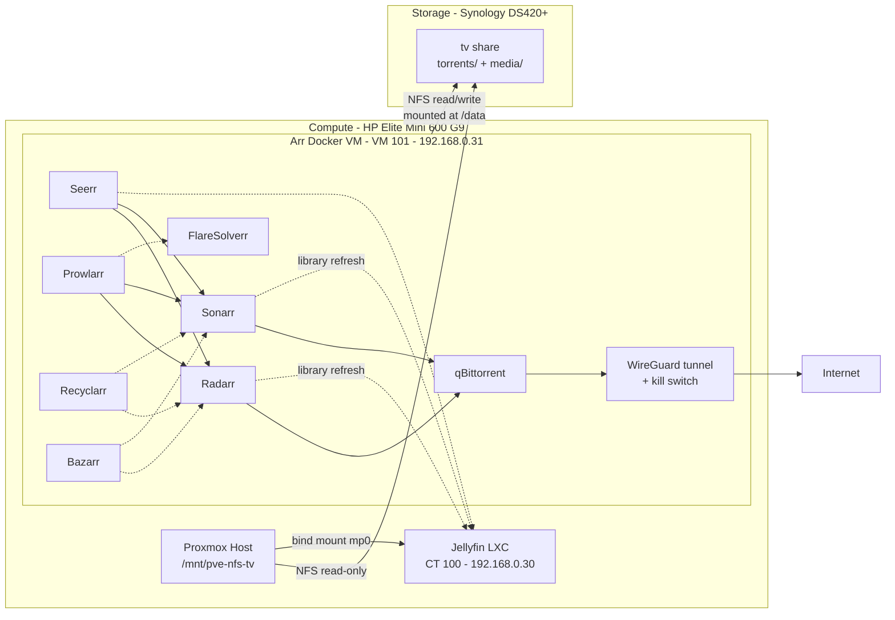

# Arr Stack (Media Automation)

The arr stack automates finding, downloading, renaming, and filing movies and TV shows into the media library that Jellyfin already serves. It is treated as **one logical service** made of tightly coupled apps: they share a single filesystem (required for hardlinks), talk to each other over API keys, and are deployed and updated together.

**Status**: Deployed (2026-10-10) on VM 101. All apps are configured, the existing library is imported and renamed, Jellyfin's libraries point at the new layout, and family members can request through Seerr. **Pending**: step 13 — confirming on the first real downloads that imports are hardlinked rather than copied, and that finished torrents are removed after seeding. See [Deployment Steps](#deployment-steps).

**Reference setup**: [automation-avenue/arr-new](https://github.com/automation-avenue/arr-new) — a single `docker-compose.yml` following the [TRaSH Guides](https://trash-guides.info/File-and-Folder-Structure/How-to-set-up/Docker/) folder layout. Used as a starting point, not copied as-is; see [Deviations from the Reference Setup](#deviations-from-the-reference-setup).

**Config files** (next to this file):

| File | Deployed at (on the VM) | Notes |
| --- | --- | --- |
| [docker-compose.yml](docker-compose.yml) | `/opt/arr-stack/docker-compose.yml` | Copied with `scp` from this repo |
| [.env.example](.env.example) | `/opt/arr-stack/.env` (real values) | The example carries the **pinned image tags actually deployed**; `PUID`/`PGID` stay placeholders |
| [recyclarr/radarr.yml](recyclarr/radarr.yml), [recyclarr/sonarr.yml](recyclarr/sonarr.yml) | `/docker/appdata/recyclarr/configs/` | Exact copies of the deployed configs. API keys are `!secret` references to `secrets.yml`, which stays on the VM only |

The real `.env`, `secrets.yml`, `wg0.conf` and all app data stay on the VM only.

---

## Components

| App | Role | Port | Access to `/data` |
| --- | --- | --- | --- |
| **Prowlarr** | Indexer manager — configures indexers once and syncs them to Radarr/Sonarr | 9696/tcp | None |
| **Radarr** | Movie automation — searches, grabs, imports, renames | 7878/tcp | Read/write |
| **Sonarr** | TV automation — same role as Radarr for series | 8989/tcp | Read/write |
| **qBittorrent** | Torrent download client, all traffic through a WireGuard VPN | 8080/tcp (Web UI) | Read/write |
| **Bazarr** | Subtitle download for Radarr/Sonarr libraries | 6767/tcp | `media/` only |
| **Seerr** | Request page — family members request movies/shows with their Jellyfin accounts | 5055/tcp | None |
| **FlareSolverr** | Cloudflare challenge solver, used by Prowlarr only for indexers that need it | 8191/tcp (Docker network only) | None |
| **Recyclarr** | Syncs TRaSH Guides quality profiles, custom formats and naming into Radarr/Sonarr, daily | — (no UI) | None |

**Not included**:
- **Jellyfin**: already deployed as its own LXC (CT 100) and stays there — see [services/jellyfin/README.md](../jellyfin/README.md). The arr stack only writes files into the library; Jellyfin reads them.
- **Lidarr** (music): not needed for now. Can be added later with `torrents/music` + `media/music` folders.

**Seerr vs Jellyseerr**: Jellyseerr and Overseerr merged into [Seerr](https://docs.seerr.dev/blog/seerr-release/) in February 2026. Jellyseerr no longer exists as a separate project, so Seerr (`ghcr.io/seerr-team/seerr`) is used instead.

---

## Architecture



### Why a VM instead of LXCs

Chosen over three alternatives (one LXC per app, Docker inside an LXC, Synology Container Manager). The deciding factors:

- **NFS mounting**: unprivileged LXCs cannot mount NFS (kernel restriction, discovered during the Jellyfin deployment — see [services/proxmox.md](../proxmox.md#service-level-storage-media-app-data)). A VM mounts NFS itself, so the host-mount-plus-bind-mount workaround isn't needed.
- **UID mapping**: the arr apps **write** to the NAS. In an unprivileged LXC, container UIDs are shifted to ~100000+ on the host, which doesn't match any Synology user. A VM has no UID shift, so the container `PUID` can match a real Synology account directly.
- **Fits the reference setup**: the compose file transfers almost unchanged, and apps reach each other by container name (`http://radarr:7878`) on a private Docker network instead of each needing its own static IP.
- **VPN containment**: the VPN tunnel and its kill switch live entirely inside the VM.

**Accepted trade-offs**: ~2–4 GB RAM and a little VM overhead; and this is the first "shared container host" on Proxmox, which is an explicit, documented exception to the one-LXC/VM-per-service rule in [services/proxmox.md](../proxmox.md#hosted-workloads) — justified because the stack is one logical service.

---

## Storage Plan

### Hardlinks: the constraint that drives the layout

Radarr/Sonarr import a finished download into the library by **hardlinking** it rather than copying it. The file then exists once on disk while qBittorrent continues seeding from `torrents/` and Jellyfin plays it from `media/`. This only works if both folders are on **the same filesystem**, which here means:

- **Same Synology shared folder** — each shared folder is a separate Btrfs subvolume, and hardlinks cannot cross subvolumes.
- **One NFS mount** inside the VM — hardlinks cannot cross separate mounts, even if they point to the same NAS.

If this is misconfigured, imports silently fall back to **copying**, doubling disk usage for everything still seeding. This matters because Volume 1 is already ~78% full (see [hardware/storage.md](../../hardware/storage.md#storage-pool--volume)).

### Folder layout (inside the existing `tv` share)

The existing `tv` share is reused (see [Decision Log](#decision-log)). Its former top-level folders `movies/` and `series/` were moved under a new `media/` folder, and a `torrents/` folder was added next to it:

```text
tv/                         (Synology shared folder, /volume1/tv)
├── torrents/               qBittorrent download location
│   ├── movies/             category "movies" (Radarr)
│   └── series/             category "series" (Sonarr)
└── media/                  library root
    ├── movies/             moved from tv/movies  → Radarr root folder
    └── series/             moved from tv/series  → Sonarr root folder
```

- **Moves are instant**: moving folders within the same shared folder is a rename, not a copy, so it needs neither free space nor time.
- **`series` rather than TRaSH's `tv`**: keeps the existing folder name and avoids a confusing `tv/media/tv` path. The plan originally assumed the folder was called `shows`; the share turned out to use `series`, so that name was kept everywhere (folders, qBittorrent category, root folder).
- Mounted in the VM at `/data`, and passed into every container that needs it as `/data:/data` (same path inside and outside the container, so the paths qBittorrent reports match what Radarr/Sonarr see — no remote path mappings needed).
- Inside each library, Radarr/Sonarr name folders `Title (Year) [tmdbid-…]` (movies) and `Title (Year) [tvdbid-…]/Season XX/` (series) — see [Recyclarr](#app-configuration-as-deployed).

### Impact on Jellyfin (CT 100)

Done on 2026-10-10 — see [services/jellyfin/README.md](../jellyfin/README.md#deployment-steps):

- **No change to the mount**: CT 100 keeps seeing the whole share at `/mnt/tv` through the same host mount and `mp0`.
- **Libraries re-created** at `/mnt/tv/media/movies` (53 movies) and `/mnt/tv/media/series` (19 series, 439 episodes).
- **Watched status and metadata may have reset**, because paths and file names changed. The folder move and the renaming were done together so Jellyfin only re-identified the library once.
- Jellyfin also sees `/mnt/tv/torrents/` (read-only). This is harmless; it is simply not added as a library.

### NFS exports on the `tv` share

| Client | Access | Squash | Purpose |
| --- | --- | --- | --- |
| Arr Docker VM (`192.168.0.31`) | **Read/Write** | **No mapping** | Downloads, imports, renames — files owned by the `arr` DSM user |
| Proxmox host (`192.168.0.2`) | **Read-Only** (unchanged) | Map all users to admin (unchanged) | Host mount bind-passed into Jellyfin CT 100 |

Synology applies squash settings per NFS rule, so the read/write rule doesn't affect the read-only one. Jellyfin keeps read-only access; only the arr VM can write. The VM mounts the share as **NFSv4.1** (negotiated automatically with `defaults` in `/etc/fstab`).

### File ownership: dedicated `arr` DSM user

- DSM user **`arr`**: **UID `1030`**, group `users` (**GID `100`**), Read/Write on `tv` only, No access on every other share, all DSM applications denied — same least-privilege pattern as `ha-backup` (see [hardware/storage.md](../../hardware/storage.md#tv-current-state-nfs-enabled-and-host-restricted)). `PUID=1030` / `PGID=100` in `.env`.
- With **No mapping**, NFS passes the client's UID/GID through unchanged, so every container runs as that UID. Seerr is the exception (it always runs as UID 1000) but never touches `/data`.
- **Local mirror account on the VM**: a system account `arr` (UID 1030, GID 100 `users`, no home, `nologin` shell) exists on the VM only so admins can run `sudo -u arr …` and `ls -l` shows names instead of numbers. It doesn't affect the containers.
- **Permissions come from DSM ACLs, not mode bits**: over NFS every file shows as `777`, yet the VM's login user `admin` (UID 1000, no DSM account) gets `Permission denied` on `/data`. This is expected — always work on the share as `arr` (`sudo -u arr`), or as root for read-only checks.
- `UMASK=002` makes new files group-writable, so every app can rename or clean up files written by the others (in practice the ACLs already allow this).

### App configuration data (appdata)

Stored on the VM's own virtual disk (`vm-disks`, local SSD) under `/docker/appdata/<app>/`, **not** on the NAS. The arr apps use SQLite databases, which are unreliable over NFS (file locking issues can corrupt them). Owned by `arr:users`, except `/docker/appdata/seerr` (UID 1000, since Seerr ignores `PUID`). Protected by `vzdump` and each app's built-in backup — see [Backup Requirements](#backup-requirements).

### Capacity guardrails

The stack grows the library automatically on a volume DSM already flags as low. As configured:

| Guardrail | Value | Notes |
| --- | --- | --- |
| Radarr/Sonarr **Minimum Free Space** | **800 GB** | Keeps Volume 1 below ~87% full. It **only blocks imports**, not downloads: a download that completes below the limit stays in `torrents/` and shows a warning in Activity → Queue. With 1.4 TB free (2026-10-10), there are ~600 GB of headroom |
| qBittorrent **seeding limits** | **Ratio 1.0 or 7 days**, then **Stop torrent** | Radarr/Sonarr's **Remove Completed** then removes torrents they've imported; the library hardlink stays |
| Existing library | Imported **unmonitored** | Otherwise both profiles would treat almost every existing file as upgradeable — see [Existing Library Migration](#existing-library-migration) |
| Seerr | **Manual approval** of every request | Each 4K movie is ~20–60 GB |
| Hardlink check | Periodically | `stat -c '%h %i %n'` on a seeding file: link count **2**, and `find /data/media -inum <inode>` finds the library copy |

---

## Deployment Specs

- **Host Platform**: Proxmox VE on HP Elite Mini 600 G9.
- **VM**: **VM 101**, hostname **`arr-stack`**, Debian **13 (trixie)**.
- **Sizing**: 2 vCPU (type `host`), 8 GB RAM (balloon device on, no minimum set, no swap), 32 GB disk on `vm-disks` (VirtIO SCSI single, Discard + IO thread + SSD emulation), machine `q35`, SeaBIOS, VirtIO NIC on `vmbr0`, QEMU guest agent enabled, **Start at boot** on. The apps are light; qBittorrent is the heaviest. Revisit if the library or torrent count grows large.
- **Memory usage**: Proxmox shows the VM at **~95% RAM** a few minutes after boot. This is normal: the figure counts the guest's page cache, which fills up with downloads and library scans over NFS. Measured on 2026-10-10: ~1.6 GiB actually used (all containers together ~1.9 GiB, none above ~370 MiB), 6.3 GiB cache, 6.1 GiB available, no OOM kills. The real checks are `available` in `free -h` (should stay well above 1 GiB), `docker stats --no-stream` per container, and `journalctl -k | grep -i oom` (should be empty). Reducing to 4 GB was considered and is viable (ideally with a swap file, or ballooning with a 4 GB minimum), but not needed while the host (32 GB) has RAM to spare.
- **Provisioning Method**: Debian's official **`genericcloud` image** + **cloud-init**, set up entirely in the Proxmox GUI (see [Decision Log](#decision-log) #8):
  1. `nas-images` got the **Import** content type; the image was downloaded there with *Import → Download from URL* (`https://cloud.debian.org/images/cloud/trixie/latest/debian-13-genericcloud-amd64.qcow2`).
  2. VM created without a disk, then *Hardware → Add → Import Hard Disk* onto `vm-disks`, resized by **+29 GB** (the GUI resize is an increment; the image is ~3 GB).
  3. *Serial Port 0* added and *Display → Serial terminal 0* — the cloud image only prints to a serial console.
  4. *CloudInit Drive* on `vm-disks`; Cloud-Init tab: user **`admin`**, no password, SSH public key, static IP, DNS `192.168.0.1`.
  5. *Options → Boot Order*: `scsi0` first. First boot ran cloud-init, including a full `apt upgrade`.
  6. Post-install: `qemu-guest-agent` installed (not in the cloud image). `unattended-upgrades` was already present and enabled (Debian security updates only).
- **Access**: SSH as `admin` with key only (password login is off in the cloud image; there is no root password). `admin` is in the `docker` group (see Decision #17).
- **Network**: static IP `192.168.0.31/24`, gateway `192.168.0.1` — next address in the `.30`–`.99` service range, see [hardware/networking.md](../../hardware/networking.md#static-ip-assignments).
- **Docker**: Docker Engine **29.8.2** + Compose plugin **v5.6.0**, from [Docker's official apt repository](https://docs.docker.com/engine/install/debian/) (`/etc/apt/sources.list.d/docker.sources`, key in `/etc/apt/keyrings/docker.asc`). Debian's own `docker.io` package was not used: it lags behind and doesn't ship the Compose plugin. `unattended-upgrades` doesn't touch Docker's repo, so Docker updates (which restart all containers) only happen on a deliberate `sudo apt upgrade`.
- **NFS mount**: `nfs-common` installed; `/etc/fstab`:
  ```text
  192.168.0.10:/volume1/tv  /data  nfs  defaults,_netdev  0  0
  ```
  `_netdev` makes the mount wait for the network at boot. Confirmed to come back on its own after the nightly backup reboot.
- **Stack location**: `/opt/arr-stack/` (owned by `admin`): `docker-compose.yml` and `.env`. Start/stop from there with `docker compose …`.
- **Container images**: [hotio](https://hotio.dev/) images for the arr apps and qBittorrent, plus the official images for Seerr, FlareSolverr, and Recyclarr. **Every tag is pinned** — see [.env.example](.env.example) for the deployed versions and [Updating image tags](#updating-image-tags).
- **Backups**: VM 101 is in the shared nightly `vzdump` job (05:00, `stop` mode) — see [Backup Requirements](#backup-requirements).

### Network Ports

| Port | Protocol | Service | Exposure |
| --- | --- | --- | --- |
| 9696 | TCP | Prowlarr Web UI | LAN |
| 7878 | TCP | Radarr Web UI | LAN |
| 8989 | TCP | Sonarr Web UI | LAN |
| 8080 | TCP | qBittorrent Web UI | LAN |
| 6767 | TCP | Bazarr Web UI | LAN |
| 5055 | TCP | Seerr Web UI | LAN |
| 8191 | TCP | FlareSolverr | Docker network only — not published |
| *(Proton forwarded port)* | TCP/UDP | qBittorrent peer traffic | Through the VPN tunnel only — **no router port forward**; the port is assigned by Proton and changes over time |

Once AdGuard Home is deployed, these become name-based entries (`radarr.home.yourdomain.tld`, `requests.home.yourdomain.tld`, etc.) — see [services/adguard-home/README.md](../adguard-home/README.md).

### VPN (qBittorrent only)

qBittorrent uses hotio's built-in WireGuard support rather than a separate VPN container:

- `VPN_ENABLED=true` brings up the tunnel inside the qBittorrent container before qBittorrent starts. hotio's nftables rules act as the **kill switch**: both chains default to `drop`, and the only exceptions are the tunnel, the Proton endpoint, the Docker network (for Radarr/Sonarr) and the Web UI from the LAN.
- `VPN_LAN_NETWORK=192.168.0.0/24` allows LAN devices to reach the Web UI despite the firewall.
- `hostname: qbittorrent.internal` is hotio's documented way for other containers on the same Docker network to reach the Web UI. Radarr/Sonarr use `qbittorrent.internal:8080` as the download client.
- The WireGuard config (`wg0.conf`, containing the VPN private key) is at `/docker/appdata/qbittorrent/wireguard/wg0.conf` on the VM, mode `600`. **It is a secret and never goes in this repo.** The original file from Proton is kept in the password manager.
- **Provider: Proton VPN** (paid plan, 24-month subscription taken in September 2026 — renewal due around September 2028). hotio supports Proton natively: `VPN_PROVIDER=proton` and `VPN_AUTO_PORT_FORWARD=true` make hotio request a forwarded port from Proton (via NAT-PMP) and set it as qBittorrent's listening port automatically, including when Proton assigns a new port after a reconnect. Port forwarding lets other peers connect to qBittorrent directly, which noticeably improves torrent connectivity.
- **Generating the WireGuard config** (Proton account → Downloads → WireGuard configuration):
  | Setting | Value | Why |
  | --- | --- | --- |
  | Platform | Linux (or Router) | Plain WireGuard config file, not tied to a Proton app |
  | NAT-PMP (Port Forwarding) | **On** | Required for `VPN_AUTO_PORT_FORWARD=true` |
  | [Moderate NAT](https://protonvpn.com/support/moderate-nat) | **Off** | Proton doesn't allow Moderate NAT and port forwarding on the same connection. It's meant for gaming and WebRTC calls, gives torrents less than a forwarded port does, and slightly weakens resistance to correlation attacks |
  | Server | A **P2P**-labelled server, ideally in a nearby country | Proton only allows torrent traffic and port forwarding on P2P servers; a nearby server keeps latency and speed reasonable. Avoid Secure Core (slower, no benefit here) |
  | NetShield | Off | Ad blocking isn't needed for qBittorrent and filtered DNS can interfere with tracker lookups |
  | VPN Accelerator | On (Proton's default) | Performance only, no impact on privacy |

  Save the file as `wg0.conf`. Each config uses one of the plan's simultaneous device slots while connected.
- **As deployed**: a Swiss P2P server (`CH#734`). The config is **tied to that one server** — if it goes down or gets slow, qBittorrent stays offline (kill switch) until a new config is generated and the container restarted. Proton's config includes IPv6 addresses (`Address`, `DNS`, `AllowedIPs = ::/0`); hotio brings the tunnel up over **IPv4 and IPv6** with the file unchanged, so no edit was needed.
- **Verified 2026-10-04**: exit IP inside the container = Proton (Zurich), different from the home IP; forwarded port assigned and reported reachable by hotio; kill switch test (`ip link delete wg0` inside the container) left `curl` unable to connect (`exit=7`) rather than falling back to the home IP. The tunnel also came back on its own after the nightly backup reboot.
- **Using the same subscription elsewhere**: Proton apps on personal devices are fine and independent of this setup. Other homelab traffic stays off the VPN on purpose — see [Future Work](#future-work) for the one possible exception (Prowlarr).

### Updating image tags

Tags are pinned so upgrades are deliberate: the arr apps occasionally migrate their databases in ways that can't be rolled back. To find the newest **stable** tag for each image (on the VM, with `skopeo` installed from Debian):

```sh
for img in hotio/prowlarr hotio/radarr hotio/sonarr hotio/qbittorrent hotio/bazarr; do
  echo "$img: $(skopeo list-tags docker://ghcr.io/$img | grep -oE '"release-[0-9]+(\.[0-9]+)+"' | tr -d '"' | sort -V | tail -1)"
done
for img in seerr-team/seerr flaresolverr/flaresolverr recyclarr/recyclarr; do
  echo "$img: $(skopeo list-tags docker://ghcr.io/$img | grep -oE '"v?[0-9]+\.[0-9]+\.[0-9]+"' | tr -d '"' | sort -V | tail -1)"
done
```

- hotio publishes several tag styles; pin only **`release-<version>`** (e.g. `release-5.2.4`). Avoid `release-v5`-style aliases (they move), commit tags (`release-4a792a9`), and **per-architecture tags ending in `-linux-arm64`/`-amd64`** — a looser filter matched an arm64 build once, which would not run on this Intel VM.
- Update one app at a time: take a manual app backup, change its tag in `.env` (and in `.env.example` here), `docker compose pull <service> && docker compose up -d <service>`.
- `docker compose pull` was once refused by `ghcr.io` mid-download (`connection refused`); `docker compose --parallel 1 pull` (one image at a time) worked.

---

## App Configuration (as deployed)

| App | Settings |
| --- | --- |
| **All Web UIs** | Forms login, **required even for local addresses**. Credentials and API keys in the password manager |
| **qBittorrent** | Own WebUI password (no bypass for localhost/LAN). Default Torrent Management Mode **Automatic**, relocate on category/save-path change; default save path `/data/torrents`; no separate incomplete folder. Categories `movies` and `series` with empty save path (→ `/data/torrents/<category>`). Listening port left to hotio; **UPnP/NAT-PMP from router off**. Seeding: ratio 1.0 or 7 days → Stop torrent |
| **Radarr** | Root folder `/data/media/movies`. Use Hardlinks **on**. Minimum Free Space **800 GB**. **Import Extra Files on** (`srt,sub,idx,sup`). Download client qBittorrent at `qbittorrent.internal:8080`, category `movies`, **Remove Completed on**. Connect → Jellyfin. Scheduled backups (7 days) |
| **Sonarr** | Same as Radarr with root folder `/data/media/series`, category `series`, Import Extra Files `srt,ass,sub,idx,sup` |
| **Prowlarr** | Apps: Radarr (`http://radarr:7878`) and Sonarr (`http://sonarr:8989`), **Full Sync**, Prowlarr server `http://prowlarr:9696`. Indexer proxy FlareSolverr (`http://flaresolverr:8191/`) with tag `flaresolverr`, applied only to indexers that fail with Cloudflare errors. Indexer traffic uses the home IP (by design, Decision #7) |
| **Recyclarr** (v8) | Configs `configs/radarr.yml` + `configs/sonarr.yml` (copies in [recyclarr/](recyclarr/)), API keys in `secrets.yml`. Generated with `recyclarr config create -t <template>`, then edited. Syncs daily on its own. **Radarr**: profiles `[French MULTi.VO] UHD Bluray + WEB` (default for requests) **and** `[French MULTi.VO] HD Bluray + WEB` (fallback for movies with no 4K release; also used for the imported library), with `assign_scores_to` keeping each *Golden Rule* group on its own profile; naming `jellyfin-tmdb`. **Sonarr**: `[French MULTi.VO] HD Bluray + WEB (1080p)`; naming `jellyfin-tvdb` + defaults. MULTi.VO = original + French audio preferred, original-only accepted, French-only rejected |
| **Bazarr** | Login on; Sonarr/Radarr by container name. Language profile **French + English** (no cutoff), default for series and movies. **Use Embedded Subtitles on** (most remuxes already carry FR/EN tracks). Subtitles saved alongside the media file. Providers with accounts where needed (credentials only in Bazarr). Scheduled backups |
| **Seerr** | Media server Jellyfin (`192.168.0.30:8096`), signed in with a Jellyfin admin account (= Seerr owner); Jellyfin users imported. Radarr: default server, not 4K, profile **UHD**, root `/data/media/movies`, minimum availability *Released*, automatic search on. Sonarr: profile HD 1080p, root `/data/media/series`, Standard type, season folders on. **Manual approval**; partial series requests allowed. Application URL `http://192.168.0.31:5055` |
| **Jellyfin** (CT 100) | Libraries `/mnt/tv/media/movies` and `/mnt/tv/media/series`; Radarr/Sonarr refresh it on import via the API key `arr-stack` |

**Quality nuances worth knowing**:
- TRaSH's UHD profile allows **Remux-1080p** as its own fallback when no 2160p release exists, and scores lossless audio highly — UHD grabs can be large. For a movie without a 4K release, switch it to the HD profile in Radarr.
- Most of the existing library is **Remux-2160p**, which **neither** profile allows. That's fine while those movies are unmonitored; monitoring one would make Radarr "upgrade" it to an allowed (smaller) release.
- Changing scores or qualities in the Radarr/Sonarr UI is undone by the next daily Recyclarr sync — change the YAML instead.

---

## Existing Library Migration

Done between 2026-10-04 and 2026-10-10, before importing into Radarr/Sonarr:

1. **Inventory first**: a full listing of the share (`find /data/media -printf '%y\t%s\t%P\n'`) analyzed offline. The folder structure turned out inconsistent, so nothing was moved before every pattern was known.
2. **Cleanup**: deleted an abandoned partial copy (`.mkv.filepart`), duplicate copies (a WEB-DL next to a remux; a disc ISO next to its MKV; *The Expanse* in both 1080p and 2160p — kept 2160p), a sample, subtitle zips, screenshots/BDInfo reports, tracker ad files, and zipped Brooklyn Nine-Nine seasons (password-protected or damaged; re-downloadable). ~200 GB freed.
3. **Restructure**: movie collection folders (`Marvel Cinematic Universe/`, `Wizarding World/`, …) flattened to one folder per movie under `movies/` — Radarr/Sonarr only see **one movie/series per top-level folder** (depth *inside* that folder doesn't matter). Grouping now comes from TMDb collections instead. Unparsable episode names fixed (`EP 7.mp4` → `S06E07`, `- E01` → `S01E01`).
4. **Library Import** in Radarr (53 movies) and Sonarr (19 series) with **Monitor: None** and the HD profiles. ⚠️ Radarr's import dialog defaulted to monitored; all movies were unmonitored right after. Check the Monitor dropdown on every row.
5. **Rename + move** (Organize, then Edit → root folder → move files) to the Jellyfin naming.
6. **Subtitles**: Radarr only renames extra files when it renames the movie, and *Import Extra Files* wasn't on yet — so the 48 movie subtitles were renamed with a generated shell script to match their video file (`.en`/`.fr` added where the old name said so). For Sonarr, *Import Extra Files* was enabled **before** Organize, so episode subtitles followed automatically, except 40 Attack on Titan `.ass` files using absolute numbering, renamed by script.
7. **Fixes after import**: One-Punch Man S01E11 had been matched as special S00E05 (moved back); *Sherlock: The Abominable Bride* imported manually as a Season 0 special. TVDB treats *Le Flambeau* as season 2 of *La Flamme* (series *Burning Love (FR)*).

Shell work on the share was always done as `arr` (`sudo -u arr bash -euo pipefail <<'EOF' … EOF`, with `mv -n`, `rmdir` instead of `rm -r` where possible, and `</dev/null` on any command that could prompt).

---

## Deviations from the Reference Setup

| Reference setup | This deployment | Why |
| --- | --- | --- |
| Jellyfin container included | Removed | Already deployed as CT 100 |
| Lidarr included | Removed (for now) | No music library planned |
| `/data` is a local directory | `/data` is a single NFS mount of the Synology `tv` share | Media lives on the NAS; one mount keeps hardlinks working |
| `PUID/PGID: 1000` | `1030` / `100` (the `arr` DSM user) | Files written over NFS must be owned by a user the NAS recognizes |
| qBittorrent's `environment:` block replaces the shared one | Shared env vars merged into every service's own `environment:` | In the reference file, YAML merge (`<<`) is shallow: qBittorrent silently drops `PUID/PGID/TZ`, working only because hotio's default UID also happens to be 1000 |
| qBittorrent `WEBUI_PORT` / `TORRENTING_PORT` | `WEBUI_PORTS` | The reference uses linuxserver.io variable names, which hotio ignores |
| `dns: 1.1.1.1` hard-coded | Removed — containers use the VM's resolver | Would bypass the planned AdGuard Home and break local name resolution |
| `json-file` logging, no size cap | `max-size: 10m`, `max-file: 3` | Uncapped logs slowly fill the VM disk |
| `:latest` image tags | Pinned per app in `.env` | Controlled upgrades, rollback possible |
| `TZ: Europe/London` + `/etc/localtime` mount | `TZ=Europe/Zurich` set once in `.env` | Redundant and wrong zone |
| No VPN; torrent port `6881` published | WireGuard with kill switch; no torrent port published | Protects the home IP; no router port forward needed |
| No `UMASK` | `UMASK=002` | Keeps group read/write consistent across apps |
| qBittorrent categories `movies` / `tv` | `movies` / `series` | Matches the existing library folder name |

---

## Backup Requirements

| What | Method | Target | Verified |
| --- | --- | --- | --- |
| Whole VM (OS, Docker, appdata, `.env`, `wg0.conf`, `secrets.yml`) | Shared nightly `vzdump` job, 05:00, `stop` mode | `nas-backups` → Synology `proxmox_backups` share (see [services/proxmox.md](../proxmox.md#backup-jobs)) | Archives every night since 2026-09-30, ~2.8 GB each. Restore not tested yet |
| Radarr / Sonarr / Prowlarr / Bazarr config + DB | Each app's built-in backup (portable `.zip`, restorable into a fresh install). Scheduled every 7 days; a manual one before any upgrade | `/docker/appdata/<app>/Backups/{scheduled,manual}/` (Bazarr: `/docker/appdata/bazarr/backup/`) — inside the `vzdump` | First manual backups 2026-10-10 (Radarr/Sonarr ~1.6 MB, Prowlarr 72 KB, Bazarr 443 KB) |
| Seerr config + DB | Covered by `vzdump` (`/docker/appdata/seerr/`) | — | — |
| qBittorrent, Recyclarr state | Covered by `vzdump` | — | — |
| Recyclarr configs | Also version-controlled in [recyclarr/](recyclarr/) (no secrets) | Git | — |
| Media files | Not backed up by this service. Downloaded media can be re-obtained; protected only by SHR redundancy | — | — |
| `docker-compose.yml`, `.env.example` | Version-controlled in this repo | Git | — |

The app-level backups fit the "upgrade to app-level backups" approach in [docs/storage-strategy.md](../../docs/storage-strategy.md#upgrading-to-app-level-backups): restoring a single app's `.zip` into a new container is quicker and safer than rolling back the whole VM. Note that the nightly `stop` backup briefly shuts the VM down at 05:00: downloads pause and the VPN reconnects (Proton may assign a new forwarded port, which hotio applies automatically).

---

## Dependencies

- **Synology DS420+** reachable over NFS, with the read/write rule for `192.168.0.31` on the `tv` share.
- **Proton VPN** paid subscription (renewal due around September 2028; if it lapses, qBittorrent stops working by design — the kill switch blocks traffic rather than falling back to the home IP). See [VPN](#vpn-qbittorrent-only).
- **Jellyfin (CT 100)**: Seerr authenticates users against Jellyfin (`http://192.168.0.30:8096`); Radarr/Sonarr refresh Jellyfin's library after imports.
- **TMDb / TVDb** metadata (through Radarr/Sonarr/Jellyfin) and the **TRaSH Guides** data (through Recyclarr).
- **AdGuard Home** (planned): optional, for name-based access only.

---

## Security Considerations

- **VPN with kill switch for qBittorrent**: torrent traffic, including seeding (which counts as distribution in most jurisdictions), must never leave from the home IP. If the tunnel drops, qBittorrent loses connectivity instead of falling back to the normal connection — verified.
- **No inbound exposure**: no router port forwards; all Web UIs LAN-only. Remote access is planned through a Tailscale subnet router (Decision 5 in [docs/network-strategy.md](../../docs/network-strategy.md), see [services/tailscale/README.md](../tailscale/README.md)): the UIs stay LAN-only and are reached over the tailnet, never port-forwarded. The router uses SNAT, so remote requests come from a LAN address and qBittorrent's `VPN_LAN_NETWORK` kill switch needs no change. How family members reach Seerr from outside is still open.
- **Authentication on every Web UI**: forms login on all arr apps and Bazarr (Bazarr starts with none), required even for local addresses; qBittorrent has its own password; Seerr uses Jellyfin accounts.
- **Secrets stay out of the repo**: API keys, the WireGuard private key, and passwords live on the VM only (`.env`, `secrets.yml`, appdata) and in the password manager. The repo has `.env.example` and the Recyclarr configs, which only reference secrets by name. When typing an API key into a shell command, read it with `read -rsp` so it isn't stored in the shell history.
- **Least privilege on the NAS**: the `arr` DSM user only has access to the `tv` share; the read/write export is restricted to `192.168.0.31`; Jellyfin's path stays read-only. With *No mapping*, root on the VM is root on the share — another reason to keep the VM's access tight.
- **VM hygiene**: SSH key authentication only (no passwords, no root login), unattended Debian security updates. `admin` is in the `docker` group, which is root-equivalent — accepted because `admin` already has passwordless `sudo` through cloud-init.

---

## Deployment Steps

Steps that change live data or the NAS are marked **(confirm first)**, per [AGENTS.md Safety Rules](../../AGENTS.md#safety-rules).

1. ✅ **Synology — service account**: DSM user `arr`, Read/Write on `tv` only, other shares No access (check that the `users` group's permissions don't grant more), applications denied. `id arr` over SSH → `uid=1030 gid=100`.
2. ✅ **Synology — NFS rule (confirm first)**: on `tv` → NFS Permissions, rule for `192.168.0.31`: Read/Write, Squash **No mapping**, security `sys`. The `192.168.0.2` read-only rule is untouched.
3. ✅ **Proxmox — VM**: VM 101 from the Debian cloud image (see [Deployment Specs](#deployment-specs)). Checks: SSH by key, guest agent shows the IP in the VM Summary, auto-updates enabled (`/etc/apt/apt.conf.d/20auto-upgrades`), internet reachable. Added to the 05:00 `vzdump` job and tested with *Run now*.
4. ✅ **VM — Docker**: Docker's apt repository, then `docker run hello-world` and `docker compose version`. `admin` added to the `docker` group.
5. ✅ **VM — NFS mount**: `nfs-common`, `/data`, the `fstab` line, `systemctl daemon-reload` + `mount -a`. Local `arr` account created (`useradd --system --uid 1030 --gid 100 --no-create-home --shell /usr/sbin/nologin arr`). Write test: `sudo -u arr touch /data/.write-test`, then `sudo ls -ln` shows `1030 100`. *(The originally planned `sudo -u "#<PUID>"` doesn't work: sudo refuses UIDs without a local account. Without the local account, `sudo setpriv --reuid=1030 --regid=100 --clear-groups <cmd>` works.)*
6. ✅ **Folder layout (confirm first)**: as `arr` with `umask 002`: `mkdir -p torrents/{movies,series} media`, then `mv movies media/` and `mv series media/`. Run `sudo -u arr` commands from a directory `arr` can enter (e.g. `cd /` first), or tools like `find` complain about the starting directory.
7. ✅ **VM — stack**: `/docker/appdata/{prowlarr,radarr,sonarr,qbittorrent/wireguard,bazarr,seerr,recyclarr}` owned by `arr:users`, `seerr` re-owned by `1000:1000`. **Recyclarr's folder must be pre-created and owned by `arr`**: it runs as `PUID:PGID` from the start and can't fix ownership itself. `/opt/arr-stack/` with the compose file and `.env` (from `.env.example`). `docker compose config --quiet` validates the file but only checks that variables are *set*, not that tags exist — `docker compose pull` is the real check.
8. ✅ **VM — VPN config**: Proton config installed with `sudo install -m 600 -o root -g root … /docker/appdata/qbittorrent/wireguard/wg0.conf`, checked with `grep -v PrivateKey`.
9. ✅ **Start**: `docker compose pull`, `docker compose up -d`, `docker compose ps` (all 8 *Up*).
10. ✅ **Verify the VPN before adding any indexer or torrent** — see [VPN](#vpn-qbittorrent-only) for results. Commands: `curl -s https://ifconfig.me` on the VM (home IP) vs `docker exec qbittorrent curl -s https://ifconfig.me` (must differ); kill switch: `docker exec qbittorrent ip link delete wg0`, then the same `curl` with `--max-time 10` must fail; `docker compose restart qbittorrent` restores the tunnel. Web UI reachable from the LAN.
11. ✅ **Configure the apps** — see [App Configuration](#app-configuration-as-deployed). Order used, which differs from the original plan: qBittorrent → Radarr/Sonarr basics → Prowlarr + FlareSolverr → **Recyclarr (profiles and naming) before the library import** → [library migration](#existing-library-migration) → Bazarr → *step 12* → Seerr (it reads availability from Jellyfin, so Jellyfin had to be fixed first).
12. ✅ **Jellyfin**: Movies and Shows libraries deleted and re-created at `/mnt/tv/media/movies` and `/mnt/tv/media/series`; Radarr/Sonarr → Jellyfin refresh set up — see [services/jellyfin/README.md](../jellyfin/README.md#deployment-steps).
13. ⏳ **Verify hardlinks** on the first downloads (one movie and one series requested through Seerr on 2026-10-10): for each downloaded file, `sudo -u arr find /data/torrents -type f -exec stat -c '%h links | inode %i | %n' {} +` must show **2 links**, and `sudo -u arr find /data/media -inum <inode>` must print the library path. A week later, check that the torrent was stopped at the seeding limit and removed by Radarr/Sonarr, with the library file still in place.
14. ✅ **Backups**: nightly VM archives confirmed; first manual app backups made for Radarr, Sonarr, Prowlarr and Bazarr (2026-10-10).
15. ✅ **Docs**: this file, [services/README.md](../README.md), [hardware/storage.md](../../hardware/storage.md), [hardware/networking.md](../../hardware/networking.md), [services/proxmox.md](../proxmox.md) and [services/jellyfin/README.md](../jellyfin/README.md) updated to the deployed state; Recyclarr configs added under [recyclarr/](recyclarr/).

---

## Decision Log

| # | Decision | Chosen | Alternatives considered |
| --- | --- | --- | --- |
| 1 | Hosting | **Docker VM on Proxmox** | One LXC per app (matches the per-service pattern but needs read/write NFS through host bind mounts with UID mapping, and one IP per app); Docker in an LXC (discouraged by Proxmox, still hits the NFS restriction); Synology Container Manager (hardlinks trivially work, but goes against "Synology mainly for storage" and the NAS has limited RAM/CPU) |
| 2 | Share for `torrents/` + `media/` | **Reuse `tv`**, move `movies/` and `series/` under `media/` | New `data` share (clean layout, but moving existing media between shares is a full copy — slow and tight on free space); keeping the folders at the share root (no Jellyfin change, but less clean, and renaming changes paths anyway) |
| 3 | NFS ownership | **Dedicated `arr` DSM user, No mapping** | Map all users to admin (simpler, but everything written ends up owned by `admin`) |
| 4 | VPN integration | **hotio built-in WireGuard** | Gluetun sidecar (more providers, can route other containers too, but one more container and the Web UI ports move onto it); no VPN (home IP exposed) |
| 5 | App scope | **Prowlarr, Radarr, Sonarr, qBittorrent, Bazarr, Seerr, FlareSolverr, Recyclarr** | Lidarr (no music library planned for now) |
| 6 | VPN provider | **Proton VPN** (paid, 24 months), Swiss P2P server, Moderate NAT off | PIA (also native in hotio, with port forwarding); any other WireGuard provider in hotio's `generic` mode |
| 7 | VPN scope | **qBittorrent only** | Also routing Prowlarr/FlareSolverr (see [Future Work](#future-work)); whole VM or whole LAN through Proton (rejected: breaks LAN access to the VM, streaming services and Home Assistant integrations, and makes everything depend on Proton) |
| 8 | VM provisioning | **Debian cloud image + cloud-init, configured in the Proxmox GUI** | Netinst ISO with manual install (most visible, no cloud-init layer to debug, but slower and more manual); cloud image via `qm` CLI (same result, scriptable, less visible) |
| 9 | VM backup mode | **Add VM 101 to the existing 05:00 `stop` job** | Separate `snapshot` job (no nightly downtime, but a second job and only crash-consistent SQLite) |
| 10 | Docker access | **`admin` in the `docker` group** | `sudo docker …` every time (explicit root, more typing — no real security gain since `admin` already has passwordless sudo) |
| 11 | Quality profiles | **TRaSH French MULTi.VO**: Radarr **UHD (2160p) by default + HD (1080p) fallback**, Sonarr **HD 1080p** | Original-audio profiles (no French audio); MULTi.VF (rejects English-only releases); VOSTFR (rejects French audio); UHD-only movies (some never arrive); HD-only movies (no 4K); German profiles |
| 12 | Naming | **Recyclarr `jellyfin-tmdb` (movies) / `jellyfin-tvdb` (series)** | `jellyfin-imdb` (some movies lack an IMDb ID); Radarr/Sonarr defaults (no IDs in folder names, weaker Jellyfin matching) |
| 13 | Existing library import | **Unmonitored, HD profile** | Monitored (would have queued "upgrades" for almost the whole library — terabytes of downloads); UHD profile (Radarr would chase 4K versions if one is ever monitored) |
| 14 | Collection folders (MCU, Wizarding World, …) | **Flatten to one folder per movie**; grouping via TMDb collections | Extra root folder per collection (keeps folders, but complicates new downloads and Seerr); Manual Import per movie (many clicks, mismatch-prone) |
| 15 | Duplicates during cleanup | **Keep the higher-quality copy** (remuxes, *The Expanse* 2160p), delete disc ISOs, partial copies and locked/damaged archives | Keep everything (Radarr/Sonarr manage one file per item; extra copies show up as duplicate versions in Jellyfin) |
| 16 | Seeding limits | **Ratio 1.0 or 7 days, then Stop** (+ Remove Completed in Radarr/Sonarr) | Ratio 2.0 / 14 days (more generous, more disk); never stop (fills the volume) |
| 17 | Minimum Free Space | **800 GB** | Smaller buffer (more room for new media, less margin on an already-full volume) |
| 18 | Subtitles | **Keep existing subtitles (renamed to match) + Bazarr FR + EN**, embedded subtitles counted | French only; also French forced; delete existing and let Bazarr re-fetch everything |
| 19 | Jellyfin libraries | **Delete and re-create** | Edit the existing libraries' folders (keeps per-user access settings) |
| 20 | Seerr approvals | **Manual approval** for now | Auto-approve with per-user quotas (planned next step, see Future Work); auto-approve without limits |

---

## Future Work

- **Finish step 13**: confirm hardlinks (2 links, same inode) on the first movie and series downloads, then a week later confirm the torrents were stopped at the seeding limit and removed, with the library files intact.
- **Test-restore VM 101** from a `vzdump` archive, like CT 100 and CT 102: restore as a temporary VMID with its network device removed (it would otherwise clash with `192.168.0.31` and mount the NAS read/write), boot it, check Docker and the appdata, then destroy it.
- **Seerr auto-approval with quotas**: after a few weeks of manual approvals, consider auto-approve plus per-user limits (e.g. 3 movies / 7 days) under Users → Edit → Quotas.
- **Hard cap on the `tv` share**: Radarr/Sonarr's Minimum Free Space only blocks imports. A DSM quota on `tv` would cap downloads too, but it would also limit family uploads over SMB — a separate decision.
- **Copy app backups off the VM**: the `.zip` backups currently live inside the VM disk (and so inside `vzdump`). Copying them to the NAS would allow restoring an app without restoring the VM.
- **Debian cloud-init template**: if more Debian VMs are built, turn a clean cloud-image VM into a Proxmox template (*Convert to template*) instead of repeating the GUI steps.
- **Prowlarr indexer traffic through the VPN (only if needed)**: if an indexer is blocked by the ISP or better not seen from the home IP, enable hotio's built-in Privoxy in the qBittorrent container (`PRIVOXY_ENABLED=true`, port 8118), which sends HTTP traffic through qBittorrent's WireGuard tunnel. Then add it in Prowlarr as an HTTP indexer proxy, tagged, and apply the tag only to the indexers that need it. Advantages: no extra container, per-indexer choice, easy to undo. Disadvantages: tagged indexers depend on the qBittorrent container being up; Cloudflare challenges VPN IPs more often, and some private trackers dislike VPN IPs. To check at that point: whether 8118 is reachable from other containers on the Docker network as-is, or also needs `VPN_EXPOSE_PORTS_ON_LAN=8118/tcp`. The alternative, if a whole-app VPN route is ever needed, is moving to a Gluetun sidecar (Decision 4 alternatives).
