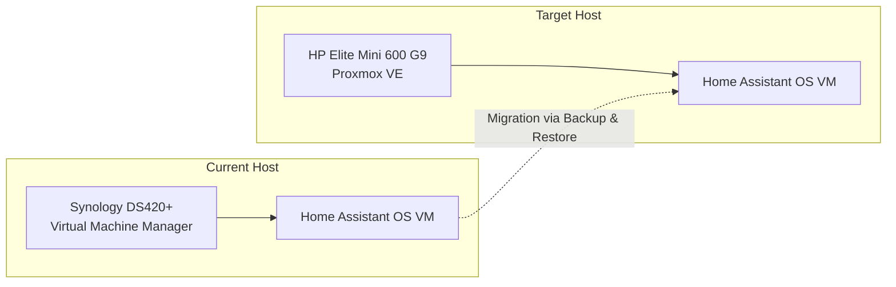

# Home Assistant OS

Home Assistant OS is the primary smart home automation hub for the homelab.

---

## VM Configuration

| Parameter | Value |
| --- | --- |
| **Deployment Type** | Home Assistant OS (VM) |
| **vCPU** | 2 Cores |
| **RAM** | 4 GB |
| **Virtual Disk** | ~32 GB |
| **Firmware** | UEFI |
| **Network** | Default VM Network Bridge |
| **Startup Policy** | Automatic startup on host boot |

---

## Current vs Target Host

---

## Migration Plan (Synology VMM → Proxmox VE)

1. **Full Backup**: Generate a complete system backup within Home Assistant.
2. **Download Backup**: Verify the `.tar` backup file is saved to the `HomeAssistantBackups` share on the Synology NAS.
3. **Provision VM on Proxmox**: Create a UEFI-enabled VM on Proxmox VE using the official Home Assistant OS qcow2/KVM image.
4. **Restore Backup**: Access the fresh Home Assistant onboarding screen and restore from the full backup.
5. **USB Passthrough**: Reconnect and pass through any USB Zigbee/Z-Wave adapters to the new Proxmox VM.

---

## Backup Configuration

- **Target Shared Folder**: `HomeAssistantBackups` on Synology DS420+.
- **Service Account**: `ha-backup` user with isolated write access.
- **Schedule**: Automatic scheduled full backups.
