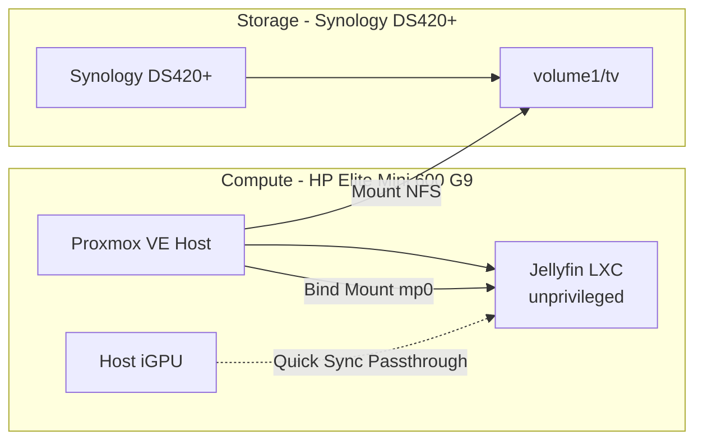

# Jellyfin Media Server

Jellyfin is the self-hosted media system for streaming movies and TV shows. It was the first new service deployed: unlike DNS/DHCP-style services, Jellyfin has no dependency in the network's critical path, so a misconfiguration or outage only affects media streaming.

**Status**: Deployed and verified. CT 100 is running with static IP, GPU passthrough, and the `tv` share mounted at `/mnt/tv`; streaming and hardware transcoding via Quick Sync are confirmed working end-to-end — see [Deployment Steps](#deployment-steps). Note: the NFS mount approach differs from the original plan — see [Media Storage](#deployment-specs) below. Remaining: app-level config backup (step 8, tracked as future work).

---

## Architecture Plan



The host mounts `tv` over NFS itself, then passes it into the Jellyfin LXC as a bind mount point — the container does not mount NFS directly. See [Media Storage](#deployment-specs) below for why.

---

## Deployment Specs

- **Host Platform**: Proxmox VE on HP Elite Mini 600 G9.
- **Deployment Type**: Unprivileged LXC container. Chosen over a VM because Jellyfin is a single application process with no need for a separate kernel or OS boundary; an LXC has lower overhead and (when Quick Sync is added later) makes `/dev/dri` device passthrough simpler than GPU passthrough into a VM.
- **Provisioning Method**: [community-scripts.org](https://community-scripts.github.io/ProxmoxVE/) Jellyfin LXC script, run with **Advanced Settings** (rather than Default) specifically to set a static IP — Default install only offers DHCP. The script is mature and widely used, and creates a correctly-sized unprivileged container with Jellyfin installed from the official apt repo. It also offers GPU passthrough setup (`setup_hwaccel`) as part of container creation, so hardware acceleration is enabled at deployment time rather than as a separate later step. A hand-rolled Ansible playbook was considered and deferred for this first service to keep initial setup simple (see repo guiding principles); revisit once a second or third service establishes a real automation pattern worth codifying.
- **Hardware Acceleration**: Host iGPU (Quick Sync Video) passed through to the container (`/dev/dri`) via the provisioning script's built-in GPU passthrough option, enabled at initial creation. See [hardware/compute.md](../../hardware/compute.md) for the GPU model (Intel UHD Graphics 770, Alder Lake — fully supports HEVC Main10 hardware decode, not just encode). See [Transcoding Configuration](#transcoding-configuration) below for the full working setup.
- **Media Storage**: NFS share (`tv` on the Synology DS420+) mounted by the **Proxmox host**, then passed into the container as a bind-style mount point (`mp0`, host `/mnt/pve-nfs-tv` → container `/mnt/tv`) — not mounted by the container itself. This differs from the originally planned guest-level NFS mount: hands-on troubleshooting found that genuinely unprivileged LXCs cannot mount NFS directly, due to a Linux kernel restriction (the NFS filesystem type isn't mountable from inside an unprivileged user namespace), not a config or permissions gap. See [services/proxmox.md](../proxmox.md#service-level-storage-media-app-data) for the full explanation and the revised pattern this establishes for future NFS-backed unprivileged LXCs. Exported read-only — sufficient because Jellyfin's metadata/cache live in its own internal data directory, not in the media folder.
- **Network**: Static IP `192.168.0.30`, set during Advanced install — see [hardware/networking.md](../../hardware/networking.md#static-ip-assignments) for the static-IP range convention (`.30`–`.99` reserved for services, ahead of the planned VLAN 20 "Servers" segment).
- **Network Port**: `8096/tcp` (HTTP web UI/streaming, Jellyfin default). No inbound port forwarding planned — LAN access only.
- **Backup Approach**: No native export; media already lives on the NAS. Config/DB directory backed up via periodic copy, per [docs/storage-strategy.md](../../docs/storage-strategy.md#upgrading-to-app-level-backups). Until that's set up, the container is covered by the baseline `vzdump` schedule targeting the Synology `proxmox_backups` share (see [services/proxmox.md](../proxmox.md)).
- **Dependencies**: Synology DS420+ reachable over NFS (`tv` share); Proxmox host network path (no VLAN dependency at this stage).
- **Container ID**: 100 (Proxmox VE).

---

## Deployment Steps

1. ✅ Run the community-scripts.org Jellyfin LXC script on the Proxmox host, choosing **Advanced Settings**.
2. ✅ Set static IP `192.168.0.30/24` (gateway `192.168.0.1`) — assigned as CT 100.
3. ✅ Enable GPU passthrough during creation so the host iGPU is wired into the container (`/dev/dri`).
4. ✅ Enable NFS on the Synology `tv` share (Control Panel → Shared Folder → `tv` → NFS Permissions) and add an export rule, scoped to **Read Only**, authorizing the **Proxmox host** (`192.168.0.2`). Squash set to **Map all users to admin** — required because NFS permission checks are server-side and based on the caller's real (host-level) UID; an unprivileged container's mapped UID (~100000+) doesn't correspond to anything the NAS recognizes, so requests were rejected regardless of the share's `777` file permissions until squash normalized every caller to one known, readable identity.
5. ✅ Mount the `tv` share on the **Proxmox host** (`/etc/fstab` entry targeting `/mnt/pve-nfs-tv`, then `mount -a`) — attempting to mount NFS directly inside CT 100 fails unconditionally; see [Media Storage](#deployment-specs) above.
6. ✅ Pass the host mount into CT 100 as a bind-style mount point: `pct set 100 -mp0 /mnt/pve-nfs-tv,mp=/mnt/tv`, then `pct reboot 100`. Confirmed readable from inside the container at `/mnt/tv`.
7. ✅ Verified streaming works end-to-end, including hardware transcoding via Quick Sync — confirmed via the Jellyfin transcode log showing `-codec:v:0 h264_qsv` with the VA-API/QSV device (`iHD` driver) initialized against `/dev/dri/renderD128`.
8. ✅ Tuned transcoding settings and resolved a transcode-cache disk-space issue found during verification — see [Transcoding Configuration](#transcoding-configuration) below for the full settings and root cause.
9. Revisit as a separate follow-up: app-level config backup (the NFS export host-restriction to `192.168.0.2` is already in place as part of step 4).

---

## Transcoding Configuration

Settings under **Dashboard → Playback → Transcoding**, arrived at through hands-on verification rather than left at their defaults:

- **Hardware acceleration**: `Intel QuickSync (QSV)`, **VA-API Device**: `/dev/dri/renderD128`.
- **Enable hardware decoding for**: HEVC checked (along with H264 and any other codecs the library uses). This is a separate toggle from hardware *encoding* — the first verification pass only confirmed hardware encode (`h264_qsv` in the ffmpeg log); a 4K HEVC test file was still decoding on the CPU until this was enabled explicitly.
- **Enable HDR tone mapping**: enabled. REMUX-quality 4K content is commonly HDR10; without this, tone-mapping down to SDR for non-HDR clients runs as a CPU filter instead of on the GPU (`tonemap_vaapi`/`vpp_qsv`).
- **Throttle Transcodes**: enabled, **Throttle after**: `300`s — caps how far ahead of the actual playback position ffmpeg is allowed to pre-generate segments.
- **Delete segments**: enabled, **Time to keep segments**: `720`s (12 minutes) — deletes each HLS segment this long after the client has downloaded it, rather than retaining every segment for the life of the session (Jellyfin's default HLS behavior, `-hls_list_size 0`, keeps everything indefinitely to support backward seeking without a second transcode job).
- **Device permissions** (not a UI setting, but required for all of the above to work): the `jellyfin` process user inside the container must be a member of the `video` and `render` groups matching `/dev/dri`'s device ownership (`card1` → `video`, `renderD128` → `render`). The community-scripts installer's `setup_hwaccel` step configures this automatically at container creation — confirmed via `id jellyfin`.

### Known Issue: Transcode Cache Filled the Container Disk

Hit during initial verification, before the **Throttle Transcodes** / **Delete segments** settings above were enabled — kept here since the symptom is confusing and easy to misdiagnose as a hardware/driver problem:

- **Symptom**: streaming a high-bitrate 4K REMUX file hung indefinitely partway through playback (a smaller/lower-bitrate file played fine), eventually producing a client-side "Fatal error".
- **Root cause**: with segment deletion off, Jellyfin's on-demand HLS transcoding retains *every* generated segment for the life of a session, so disk usage climbs for as long as the file is watched or sought, uncapped. CT 100's root disk is a shared 32 GB (OS + app + transcode cache); a single full-length 4K transcode can need 20+ GB just for video segments. Once the disk filled (`df -h /` at 100%, `du -sh /var/cache/jellyfin/transcodes/` accounting for nearly all of it), ffmpeg could no longer write new segments (`ENOSPC`) and stalled — CPU usage stayed non-zero throughout (the process wasn't deadlocked, just unable to make progress), which is why it looked like a hang rather than an immediate error.
- **Fix**: enabling **Delete segments** (`Time to keep segments: 720`) and **Throttle Transcodes** (`Throttle after: 300`) together bounds resident transcode data to roughly `(300s + 720s) × bitrate` — on the order of ~2.5 GB worst case for this movie, instead of the full transcoded file — comfortably within the existing 32 GB disk. No disk resize was needed once these were enabled.
- **If this recurs**: check `df -h /` and `du -sh /var/cache/jellyfin/transcodes/` first. Stale cache left behind by a crashed/killed ffmpeg session can be cleared safely, since it's pure ephemeral output:
  ```bash
  systemctl stop jellyfin
  rm -rf /var/cache/jellyfin/transcodes/*
  systemctl start jellyfin
  ```

---

## Future Work

- **App-level config backup**: covered by deployment step 9 — evaluate whether Jellyfin's config/DB directory warrants a dedicated periodic copy alongside the `vzdump` baseline, per [docs/storage-strategy.md](../../docs/storage-strategy.md#upgrading-to-app-level-backups).
- **Full hardware decode+tonemap pipeline**: confirm (via a fresh transcode log) that hardware decoding and tone-mapping are actually engaging for HDR/HEVC sources now that the relevant checkboxes are enabled, not just the encode step.
