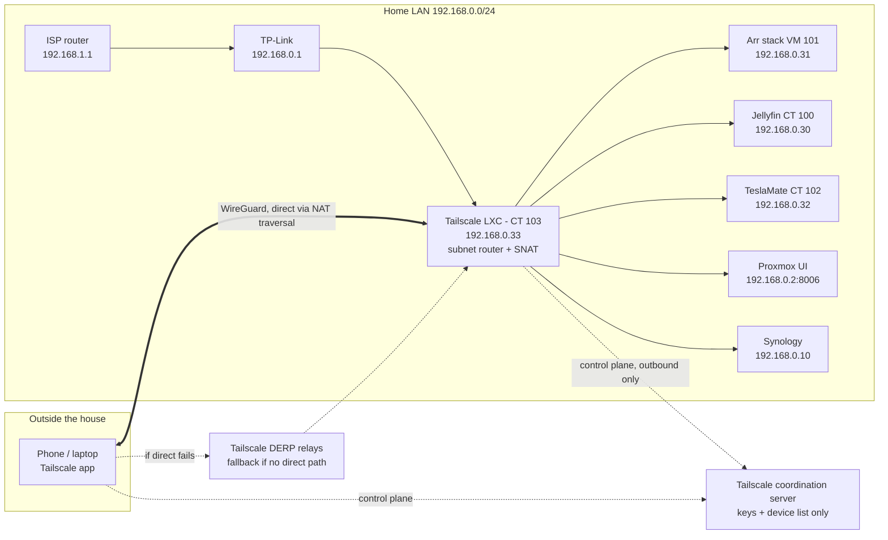

# Tailscale (Remote Access)

[Tailscale](https://tailscale.com/) is a WireGuard-based overlay network. Each device that has the Tailscale app joins a private network (the *tailnet*) and can reach the others directly, even through NAT, without opening any port on the router. One node, the **subnet router**, advertises the home LAN (`192.168.0.0/24`) to the tailnet, so a phone or laptop outside the house can reach every existing service at its usual LAN address: the arr stack, Jellyfin, Proxmox, Home Assistant, TeslaMate, the NAS.

This implements **Decision 5, Proposition A** in [docs/network-strategy.md](../../docs/network-strategy.md#decision-5-remote-access) (VPN-only remote access, no public exposure).

**Status**: Planned (2026-10-10). Nothing deployed yet. CT ID, IP and hostname below are **proposed** and follow the existing conventions; confirm them before step 2.

---

## Architecture Plan



- **No inbound port forwards** on either router. `tailscaled` only makes outbound connections; NAT traversal punches through the double NAT (ISP router → TP-Link) in most cases, and Tailscale's DERP relays carry the traffic when it can't.
- **SNAT on** (Tailscale's default on Linux): traffic from remote devices reaches LAN hosts with the subnet router's LAN address (`192.168.0.33`) as source. LAN hosts therefore need no return route, and the TP-Link needs no change. It also keeps qBittorrent reachable: its kill switch only answers `VPN_LAN_NETWORK` (`192.168.0.0/24`), see [docker-compose.yml](../arr-stack/docker-compose.yml) — a `100.x.y.z` Tailscale address would be dropped.
- **Nothing changes on the existing services.** They stay LAN-only and keep their own logins; Tailscale only adds a way for authorised devices to *be* on the LAN.

---

## Deployment Specs

- **Host Platform**: Proxmox VE on HP Elite Mini 600 G9.
- **Deployment Type**: Unprivileged LXC with `/dev/net/tun` passed through (the only extra permission Tailscale needs, per [Tailscale's LXC guide](https://tailscale.com/kb/1130/lxc-unprivileged)).
- **Container ID**: 103 *(proposed — next free ID after CT 102)*.
- **Hostname**: `tailscale` *(proposed)*. Also the machine name shown in the Tailscale admin console.
- **Base image**: Debian 13 standard LXC template, stored on `nas-images`.
- **Sizing**: 1 vCPU, 512 MB RAM, 512 MB swap, 4 GB disk on `vm-disks`. `tailscaled` uses well under 100 MB RAM; the ISP upload speed will limit throughput long before one core does. Cores and RAM can be raised live if needed.
- **Provisioning Method**: plain Debian LXC from the Proxmox GUI, Tailscale installed from Tailscale's official apt repository (see [Decision Log](#decision-log) #2).
- **Network**: static IP `192.168.0.33/24` *(proposed — next address in the `.30`–`.99` service range, see [hardware/networking.md](../../hardware/networking.md#static-ip-assignments))*, gateway `192.168.0.1`.
- **Start at boot**: **yes**. After a power cut, remote access must come back on its own.
- **Advertised route**: `192.168.0.0/24` (the whole LAN). Who may use which part of it is controlled by the tailnet policy, see [Access Policy](#access-policy).
- **Updates**: Tailscale's built-in auto-update (`tailscale set --auto-update`) for Tailscale itself; Debian `unattended-upgrades` for the OS.

### Network Ports

| Port | Protocol | Direction | Purpose |
| --- | --- | --- | --- |
| 41641 | UDP | Outbound (and replies) | WireGuard data between Tailscale nodes; Tailscale's default listening port |
| 3478 | UDP | Outbound | STUN, used to discover the public address for NAT traversal |
| 443 | TCP | Outbound | Coordination server, DERP relays (fallback path), package and update downloads |

**No inbound ports and no router port forwards.** Nothing listens on the LAN except SSH (key only).

### Storage

- Local disk only. The only state is `/var/lib/tailscale/` (the node's identity key and settings), a few kilobytes. Nothing is mounted from the NAS.

---

## Access Policy

Tailscale's default policy lets every device in the tailnet reach every other device and every approved subnet route. That's acceptable **while the tailnet contains only the owner's own devices**, which is the scope of this deployment.

Before anyone else (family) is added, replace the default with a policy that limits them to the services they need — e.g. Seerr (`192.168.0.31:5055`) and Jellyfin (`192.168.0.30:8096`) only — and keeps the admin UIs (Proxmox, arr apps, qBittorrent, NAS) for the owner. How family members get access is an open decision, see [Future Work](#future-work).

---

## Backup Requirements

- Add CT 103 to the existing 05:00 `vzdump` job (stop mode) in [services/proxmox.md](../proxmox.md#backup-jobs). Remote access drops for ~30 s each night at 05:00 — acceptable.
- **Not critical data**: if the backup is lost, a fresh container + `tailscale up` recreates the node in a few minutes. The backup mainly saves re-approving the route and re-disabling key expiry.
- **Test restores must not have a network**: a restored copy holds the same node key as the live container. Booted with `net0`, it would join the tailnet as the same machine and fight the original for the connection. Same procedure as CT 100/102: restore as a temporary ID, remove `net0`, check `/var/lib/tailscale/` exists, destroy.

---

## Dependencies

- **Tailscale account** and its identity provider login (Google, Apple, Microsoft, GitHub, …). The coordination server must be reachable for new connections and key changes; already-established connections keep working for a while if it's briefly down.
- **Proxmox host and CT 103 up**. If either is down, remote access is gone, including access to fix it remotely — see [Known Limitations](#known-limitations).
- **Tailscale app** on every remote device.

---

## Security Considerations

- **The identity provider account is now a key to the LAN.** Whoever can log in to it can add a device to the tailnet. Use an account with strong 2FA (passkey or authenticator app), not SMS.
- **Device approval on** (admin console → Settings → Device management): a newly logged-in device can't reach anything until it's approved by hand. Protects against a stolen IdP session silently adding a device.
- **Key expiry disabled only on the subnet router.** Personal devices keep the default expiry and re-authenticate periodically; an unattended server can't, so its expiry is turned off.
- **No public exposure**: no port forwards, no public DNS records. Scanners on the internet see nothing new.
- **App logins stay on.** The arr apps, qBittorrent, Proxmox and the NAS keep their own authentication, so a compromised Tailscale device still faces a login on each service.
- **Least privilege in the container**: unprivileged LXC, only `/dev/net/tun` added; no NAS mounts; SSH by key only; Tailscale SSH not used.
- **What Tailscale (the company) sees**: device names, Tailscale IPs, public IPs and connection metadata. Traffic is end-to-end encrypted by WireGuard; relayed traffic through DERP is still encrypted. `tailscaled` also sends diagnostic logs to Tailscale by default — these can be turned off with `--no-logs-no-support`, at the cost of Tailscale support not being able to help.
- **Optional hardening, not planned now**: [Tailnet Lock](https://tailscale.com/kb/1226/tailnet-lock) — new devices must be signed by a trusted device, so even a compromised coordination server can't add one. Adds a signing step for every new device.

---

## Known Limitations

- **Remote networks that also use `192.168.0.0/24`.** This is a very common default (TP-Link and many others). On such a network — a friend's house, some hotels — the remote device's own LAN route is as specific as the advertised one, and on macOS/Windows the local route wins ([Tailscale docs](https://tailscale.com/docs/reference/troubleshooting/network-configuration/lan-traffic-overlapping-subnets)), so the home services are unreachable. Workarounds today: switch the phone to mobile data or use its hotspot. Lasting fix: renumber the home LAN to an uncommon range when VLANs are introduced (Phase 2 in [docs/network-strategy.md](../../docs/network-strategy.md#suggested-phased-rollout)). [4via6 routing](https://tailscale.com/kb/1201/4via6-subnets) is another option, but it replaces familiar IPv4 addresses with long IPv6 ones.
- **At home with Tailscale on**: same overlap, other direction. On macOS/Windows the local route wins and traffic stays on the LAN, which is what we want. Behaviour on iOS/Android is not documented by Tailscale — check in [step 9](#deployment-steps) that Jellyfin at home still streams directly. If not, turn Tailscale off at home (or use the app's on-demand rules).
- **Single point of failure on Proxmox.** If the HP is down, there's no remote access to diagnose it. A possible later mitigation: a second subnet router advertising the same route from the Synology Tailscale package, for automatic [failover](https://tailscale.com/kb/1115/high-availability). Not planned now (keeps the Synology storage-only).
- **Double NAT may force relayed connections.** If NAT traversal fails, traffic goes through DERP: it works, but with more latency and lower speed (noticeable for remote Jellyfin). Checked in step 9. If it's a problem, forwarding UDP 41641 on both routers would allow direct connections — that's a router change and needs a separate decision.
- **Names**: until AdGuard Home exists, services are reached by IP. Afterwards, Tailscale [split DNS](https://tailscale.com/kb/1054/dns) can send `home.yourdomain.tld` queries to AdGuard over the subnet route, so the same names work remotely.

---

## Deployment Steps

Commands run on the **Proxmox host** shell unless stated otherwise. No step changes the router, DHCP or DNS.

0. ⬜ **Prepare the account**:
   - Create the Tailscale account (free Personal plan) at [login.tailscale.com](https://login.tailscale.com), signing in with the identity provider chosen above. Check 2FA is on for that IdP account.
   - Admin console → Settings → Device management: enable **device approval** (new devices must be approved manually).
   - Install the Tailscale app on the phone and log in (approve it in the console). This is the test client for step 9.
1. ⬜ **Template**: in the GUI, `nas-images` → **CT Templates** → **Templates**, pick the latest `debian-13-standard`, **Download**. CLI equivalent:
   ```bash
   pveam update
   pveam available --section system | grep debian-13
   pveam download nas-images <template-name-from-the-list>
   ```
   `pveam update` refreshes Proxmox's list of downloadable templates, `pveam available` shows the Debian 13 ones, and `pveam download` stores the chosen one on `nas-images` with the other templates.
2. ⬜ **Create the container** (GUI → **Create CT**): CT ID `103`, hostname `tailscale`, **Unprivileged** checked, SSH public key, root password into the password manager; template from step 1; disk `4` GB on `vm-disks`; 1 core; 512 MB RAM, 512 MB swap; `net0` on `vmbr0`, static `192.168.0.33/24`, gateway `192.168.0.1`; DNS: use host settings. **Don't** tick *Start after created*. Then **Options → Start at boot: Yes**.
3. ⬜ **Pass through the TUN device**:
   ```bash
   pct set 103 --dev0 /dev/net/tun
   ```
   Tailscale creates a virtual network interface (`tailscale0`) through `/dev/net/tun`. An unprivileged container can't access that device by default; this line gives CT 103, and only CT 103, access to it. Same as GUI → CT 103 → Resources → Add → Device Passthrough. It's Proxmox's native equivalent of the two raw `lxc.*` lines in Tailscale's guide.
4. ⬜ **Base system** (start the container with `pct start 103`, then `pct enter 103` opens a root shell inside it):
   ```bash
   apt update && apt full-upgrade -y
   apt install -y curl unattended-upgrades
   dpkg-reconfigure -plow unattended-upgrades
   ```
   Brings the template up to date, installs `curl` (needed in step 6) and enables automatic Debian security updates, same as VM 101. Answer **Yes** to the prompt.
5. ⬜ **Enable IP forwarding** (inside the container):
   ```bash
   printf 'net.ipv4.ip_forward = 1\nnet.ipv6.conf.all.forwarding = 1\n' > /etc/sysctl.d/99-tailscale.conf
   sysctl -p /etc/sysctl.d/99-tailscale.conf
   ```
   A subnet router forwards packets between `tailscale0` and the LAN interface; Linux drops forwarded packets unless forwarding is on. The file makes it permanent, `sysctl -p` applies it now. It only affects the container's own network stack, not the Proxmox host. Both lines should echo back with `= 1`.
6. ⬜ **Install Tailscale** from the official repository (inside the container):
   ```bash
   curl -fsSL https://pkgs.tailscale.com/stable/debian/trixie.noarmor.gpg -o /usr/share/keyrings/tailscale-archive-keyring.gpg
   curl -fsSL https://pkgs.tailscale.com/stable/debian/trixie.tailscale-keyring.list -o /etc/apt/sources.list.d/tailscale.list
   apt update && apt install -y tailscale
   ```
   The first line saves Tailscale's signing key, the second adds their Debian 13 (`trixie`) repository, signed with that key, and the third installs `tailscale`/`tailscaled`. The service starts and is enabled at boot automatically. Using the repo (rather than piping `install.sh` to a shell) keeps every step visible and lets apt handle updates.
7. ⬜ **Join the tailnet and advertise the LAN** (inside the container):
   ```bash
   tailscale up --advertise-routes=192.168.0.0/24 --accept-dns=false
   tailscale set --auto-update
   ```
   `tailscale up` prints a login URL: open it on the Mac and sign in with the tailnet account. `--advertise-routes` offers the home LAN to the tailnet (it stays inactive until approved in step 8). `--accept-dns=false` keeps the container's own DNS settings instead of switching it to Tailscale's resolver — a router node doesn't need MagicDNS. SNAT stays at its default (on), and `--accept-routes` is deliberately not used (it's off by default on Linux, and a subnet router shouldn't route its own LAN through the tailnet). `tailscale set --auto-update` lets Tailscale update itself through apt.
8. ⬜ **Admin console** ([login.tailscale.com/admin/machines](https://login.tailscale.com/admin/machines)), on the `tailscale` machine:
   - **Approve** the device (device approval from step 0).
   - **⋯ → Edit route settings** → tick `192.168.0.0/24` → Save. The machine shows a *Subnets* badge.
   - **⋯ → Disable key expiry.**
9. ⬜ **Verify from outside**, on the phone with **Wi-Fi off** (mobile data) and Tailscale on:
   - Seerr `http://192.168.0.31:5055`, Radarr `:7878`, Jellyfin `http://192.168.0.30:8096`, Proxmox `https://192.168.0.2:8006` load.
   - qBittorrent `http://192.168.0.31:8080` loads: confirms SNAT works with its kill switch.
   - Inside CT 103: `tailscale status` lists the phone; `tailscale ping <phone-name>` shows `via <ip>:<port>` for a direct connection or `via DERP(...)` for a relayed one. `tailscale netcheck` reports the NAT type. Record which one appears (see [Known Limitations](#known-limitations) — double NAT).
   - Play a few minutes of a film in Jellyfin remotely and check it doesn't stall.
   - **Back home on Wi-Fi with Tailscale still on**: Jellyfin still plays, and `tailscale status` on CT 103 shows no traffic from the phone — confirms local traffic isn't hairpinning through the tunnel.
10. ⬜ **Backups**: add CT 103 to the 05:00 job (Datacenter → Backup → Edit). After the first run, test-restore as a temporary ID **with `net0` removed** (see [Backup Requirements](#backup-requirements)), check `/var/lib/tailscale/tailscaled.state` exists, then destroy it.
11. ⬜ **Docs**: mark Deployed in [services/README.md](../README.md); add CT 103 to [hardware/networking.md](../../hardware/networking.md#static-ip-assignments), to *Hosted Workloads* and the backup job table in [services/proxmox.md](../proxmox.md); record the results of steps 9 and 10 here.

### Rollback

Nothing outside CT 103 and the Tailscale account changes, so undoing it is: `tailscale logout` inside the container (or remove the machine in the admin console), then destroy CT 103. Remote devices simply lose access; the LAN is unaffected.

---

## Decision Log

| # | Decision | Chosen | Alternatives considered |
| --- | --- | --- | --- |
| 1 | Remote access approach | **Tailscale subnet router** (Decision 5 Prop A): no open ports, works through the double NAT, one node covers every LAN service, easy to undo | Self-hosted WireGuard (no third party, but needs a UDP forward on both routers, a public IPv4 and dynamic DNS); Headscale (self-hosted coordination server: no Tailscale account, but one more service to run and keep available); Cloudflare Tunnel for Seerr only (no app for family, but public URL and Cloudflare sees the traffic — kept as a possible later addition); reverse proxy + port 443 (most exposure, belongs after VLANs) |
| 2 | Where it runs | **Dedicated unprivileged LXC on Proxmox, plain Debian + official Tailscale repo**: tiny, transparent, same backup path as the other guests, follows "one service per guest" | community-scripts `add-tailscale-lxc` addon on a Debian CT (same end result; does the TUN config and install in one go, but pulls more remote code and adds telemetry for a three-command install); Tailscale on VM 101 only (no new guest, but reaches only the arr stack and needs `100.64.0.0/10` added to qBittorrent's `VPN_LAN_NETWORK`); Tailscale on the Proxmox host (survives guest failures, but modifies the hypervisor); Synology Tailscale package (independent of Proxmox, but makes the NAS a network service — kept as a possible failover router) |
| 3 | Routes advertised | **Whole `192.168.0.0/24`**, restricted later by policy if others join | Individual `/32` host routes (narrower, but every new service needs a route change; and `/32`s would also win over the LAN route at home, sending local traffic through the tunnel) |
| 4 | SNAT | **On (default)**: no router change, qBittorrent kill switch keeps working | Off (LAN hosts see real Tailscale IPs, but needs a static route for `100.64.0.0/10` on the TP-Link and a `VPN_LAN_NETWORK` change) |
| 5 | Exit node | **Not now** | Advertise as exit node so the phone can use the home connection on untrusted Wi-Fi — easy to add later with `tailscale set --advertise-exit-node` |
| 6 | Updates | **`tailscale set --auto-update`** + Debian `unattended-upgrades` | Add Tailscale's repo to `unattended-upgrades` origins (one mechanism, but auto-update status is also visible in the admin console); manual updates |

---

## Future Work

- **Family access to Seerr/Jellyfin** (open decision): (a) invite them to the tailnet with a restrictive policy (they install the app; check the current free-plan user limit); (b) Cloudflare Tunnel + Cloudflare Access for Seerr only (browser only, but public exposure); (c) keep it LAN-only. Write the access policy before doing (a).
- **Split DNS** once AdGuard Home is deployed, so `*.home.yourdomain.tld` names work remotely.
- **Failover subnet router** on the Synology package, if losing remote access during a Proxmox outage becomes a real problem.
- **Exit node**, if a need for it appears.
- **Renumber the LAN** away from `192.168.0.0/24` when VLANs are introduced, to remove the overlap limitation.
