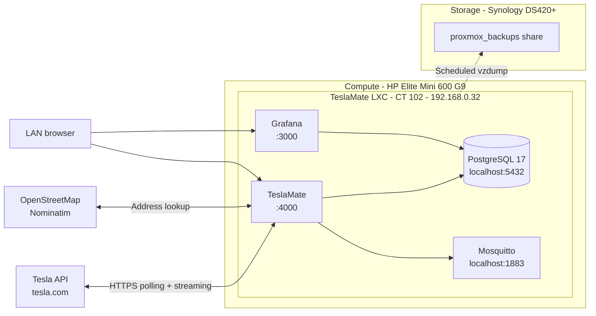

# TeslaMate

[TeslaMate](https://github.com/teslamate-org/teslamate) is a self-hosted data logger for Tesla vehicles. It polls the Tesla API and records drives, charging sessions, battery health, efficiency, and software updates into PostgreSQL, then shows them in a set of prebuilt Grafana dashboards. It can also publish live vehicle state over MQTT for home automation.

**Status**: Deployed and verified on 2026-10-03. CT 102 runs TeslaMate 4.3.0 with Grafana, the car is logging, the nightly `pg_dump` and `vzdump` backups are in place, and a test restore passed — see [Deployment Steps](#deployment-steps). [MQTT / Home Assistant integration](#mqtt--home-assistant-integration-open-decision) is deferred until Home Assistant has moved to Proxmox.

**Provisioning script**: [community-scripts.org — TeslaMate](https://community-scripts.org/scripts/teslamate) ([`ct/teslamate.sh`](https://github.com/community-scripts/ProxmoxVE/blob/main/ct/teslamate.sh) + [`install/teslamate-install.sh`](https://github.com/community-scripts/ProxmoxVE/blob/main/install/teslamate-install.sh)). Reviewed on 2026-10-02 against TeslaMate v4.3.0 and the upstream docs; see [What the Script Installs](#what-the-script-installs) and [Deviations from Upstream](#deviations-from-upstream).

---

## Architecture Plan



Everything runs inside one container: the app, its database, Grafana, and a local MQTT broker. Nothing is mounted from the NAS. The database is small and write-heavy, so it stays on local disk (`vm-disks`), in line with [services/proxmox.md](../proxmox.md#why-disk-image--container-stay-local).

---

## What the Script Installs

**`ct/teslamate.sh`** runs as root on the Proxmox host. It creates an **unprivileged Debian 13 LXC** (defaults: 2 vCPU, 4 GB RAM, 16 GB disk, tags `car;monitoring`). It also contains the update routine, which runs when you type `update` inside the container (see [Updates](#updates)).

**`install/teslamate-install.sh`** runs inside the new container:

| Component | What the script does |
| --- | --- |
| Base packages | `build-essential`, Debian's Erlang (OTP 27), `mosquitto` (Debian default config), UTF-8 locale |
| Elixir | The **latest** prebuilt Elixir for OTP 27, in `/opt/elixir`, symlinked into `/usr/local/bin` |
| PostgreSQL | v17. Database and user `teslamate`, random password, **SUPERUSER** granted |
| Node.js | v22, only used to build the web assets |
| Grafana | The **latest** version from `apt.grafana.com stable` |
| TeslaMate | Latest GitHub release downloaded to `/opt/teslamate` and **compiled from source** (`mix release`, `npm run deploy`) |
| App config | `/opt/teslamate.env` (mode 600): random `ENCRYPTION_KEY`, DB credentials, `TZ=UTC`, `PORT=4000`, `MQTT_HOST=127.0.0.1` |
| Grafana config | Provisioned `TeslaMate` PostgreSQL data source and the dashboards from `/opt/teslamate/grafana/dashboards`. Minimal `/etc/grafana/grafana.ini` (telemetry off, sign-up off, gravatar off, embedding allowed) |
| Service | `teslamate.service`, runs **as root**, applies DB migrations (`TeslaMate.Release.migrate`) on every start |

Every service listens on all interfaces except PostgreSQL and Mosquitto, which stay on localhost (Debian defaults).

---

## Deviations from Upstream

TeslaMate's documentation recommends [Docker](https://docs.teslamate.org/docs/installation/docker). Its manual Debian install is filed under `installation/unsupported/` and titled "Manual install - Debian (no support)". The community script is an automated version of that unsupported path. The table below lists where it differs from upstream, and what this deployment does about each difference.

| # | Upstream (Docker) | Community script | Impact | Handling here |
| --- | --- | --- | --- | --- |
| 1 | Supported install method | Unsupported manual path | Upstream may ask to reproduce issues on Docker; support comes from community-scripts instead | Accepted, see [Decision Log](#decision-log) |
| 2 | Prebuilt, signed images | Compiled from source on install and on every update | Updates take several minutes and need RAM (the reason for 4 GB). A failed build leaves the service stopped | Protected `vzdump` before every update |
| 3 | Elixir 1.20.3 / OTP 29, pinned | Debian OTP 27 + **latest** Elixir | Works today (TeslaMate needs Elixir 1.19 or later). A future Elixir dropping OTP 27, or TeslaMate needing a newer OTP, would break an update | First thing to check if an update fails to build |
| 4 | `teslamate/grafana` image, pinned to a tested version (13.2.3 at review time), with extra hardening (anonymous and basic auth off, alerting off, plugin preinstall off) | Latest Grafana from apt | A routine `apt upgrade` can move Grafana ahead of what the dashboards were tested with | `apt-mark hold grafana`, see [step 5](#deployment-steps) |
| 5 | Dashboards in three separate flat folders | Main dashboard provider points at a folder that also contains `internal/` and `reports/`, and Grafana scans subfolders | **Confirmed 2026-10-03**: 4 dashboard UIDs found twice (3 in `internal/`, 1 in `reports/`). Grafana logs `the same UID is used more than once` every 30 s and then **disables writes for all three providers** (`provider has no database write permissions because of duplicates`), so dashboards can be missing or stop updating | Fixed in [step 6](#deployment-steps): single dashboard provider with `foldersFromFilesStructure` |
| 6 | `TZ` set by the user | `TZ=UTC` | Wrong local timestamps in logs | Set to `Europe/Zurich` in `/opt/teslamate.env`, [step 4](#deployment-steps) |
| 7 | `pg_dump` backup, copied off the host | No backup | — | `vzdump` + nightly `pg_dump`, see [Backup Requirements](#backup-requirements) |
| 8 | App runs as a non-root user with all capabilities dropped | App runs as root inside the container | Mitigated by the container being unprivileged | Accepted |
| 9 | Docs say SUPERUSER can be revoked after the first migrations | SUPERUSER kept | Migrations run on every start and may create Postgres extensions (`cube`, `earthdistance`), which needs elevated rights | Kept: revoking risks a failed start after an update |
| 10 | Mosquitto port not published | Mosquitto 2 with Debian's default config, which listens on **localhost only** | Home Assistant can't reach this broker as installed | Open decision, see [MQTT](#mqtt--home-assistant-integration-open-decision) |

PostgreSQL 17 is within upstream's supported range (16.7+, 17.3+, or 18). Upstream's Docker setup uses 18. A future major upgrade is done inside the container (dump and restore, or `pg_upgradecluster`), not with upstream's Docker procedure.

---

## Deployment Specs

- **Host Platform**: Proxmox VE on HP Elite Mini 600 G9.
- **Deployment Type**: Unprivileged LXC. TeslaMate is a small, always-on app with no hardware or NAS access needs, the same profile as Jellyfin minus the GPU.
- **Container ID**: 102.
- **Hostname**: `teslamate` (the script's default).
- **Sizing**: 2 vCPU, 4 GB RAM, 16 GB disk on `vm-disks` (script defaults). Upstream needs only 1–2 GB to run, but the source build during `update` needs the extra RAM, so don't shrink it. The database grows slowly; check `df -h /` occasionally.
- **Provisioning Method**: community-scripts TeslaMate script, run with **Advanced Settings** to set a static IP (Default only offers DHCP), same as Jellyfin.
- **Network**: static IP `192.168.0.32/24`, gateway `192.168.0.1`. This is the next address in the `.30`–`.99` service range, see [hardware/networking.md](../../hardware/networking.md#static-ip-assignments).
- **Time zone**: `Europe/Zurich` (`TZ` in `/opt/teslamate.env`).
- **Config file**: `/opt/teslamate.env` in the container. It holds the encryption key and DB password, so it **never goes in this repo**.
- **Tesla API**: default Owner API, with tokens generated outside TeslaMate (see [step 0](#deployment-steps)). The Fleet API is optional and not used.
- **Vehicles**: the Tesla account has two cars; **only the car with VIN ending `433499` is logged** and it is **first** in TeslaMate's **Settings → Car Order**, so it's the default in Grafana's car dropdowns and comes first on the Overview. The other car stays in the database with **Settings → Data Collection → Enabled** off. See [Vehicles](#vehicles) for why it isn't deleted.

### Network Ports

| Port | Protocol | Service | Exposure |
| --- | --- | --- | --- |
| 4000 | TCP | TeslaMate web UI | LAN only. **No login on this UI**, see [Security Considerations](#security-considerations) |
| 3000 | TCP | Grafana dashboards | LAN only |
| 5432 | TCP | PostgreSQL | Container localhost only |
| 1883 | TCP | Mosquitto (MQTT) | Container localhost only, until the [MQTT decision](#mqtt--home-assistant-integration-open-decision) |

Outbound: Tesla API and auth hosts, `nominatim.openstreetmap.org` (turns GPS coordinates into addresses), `api.github.com` (update check). No inbound ports or router port forwards.

Once AdGuard Home is deployed, these can become name-based entries (e.g. `teslamate.home.yourdomain.tld`), see [services/adguard-home/README.md](../adguard-home/README.md).

---

## MQTT / Home Assistant Integration (open decision)

TeslaMate publishes live vehicle state (location, battery level, charging state, etc.) over MQTT. Home Assistant can use it for automations. This is optional: the dashboards work without it. **Deferred until Home Assistant has moved to Proxmox** ([services/home-assistant/README.md](../home-assistant/README.md)), since option A depends on where HA's broker ends up.

| Option | How | Advantages | Disadvantages |
| --- | --- | --- | --- |
| **A. Publish to Home Assistant's broker** | Point `MQTT_HOST`, `MQTT_USERNAME`, `MQTT_PASSWORD` at HA's Mosquitto add-on and set `MQTT_HOME_ASSISTANT_DISCOVERY=true` | Entities appear in HA automatically; one broker in the homelab | TeslaMate's MQTT depends on HA being up; HA's broker needs a TeslaMate user |
| **B. Open the container's broker** | Add a LAN listener with authentication to the container's Mosquitto; HA connects to it or bridges it | No dependency between the two services | Two brokers to secure and maintain |
| **C. Disable MQTT** | `DISABLE_MQTT=true`, optionally remove `mosquitto` | Smallest attack surface | No Home Assistant integration |

**Until decided**: leave the local broker as installed. It only listens on localhost, so it's harmless.

---

## Vehicles

The Tesla account TeslaMate signs in with has two cars. Only one is logged. VINs are shortened to their last 6 characters in this repo; the full VIN is visible in TeslaMate and Grafana.

| VIN | Data collection | Car Order | Name shown |
| --- | --- | --- | --- |
| VIN ending `433499` | **Enabled**: the only car logged | **First** | `???` in TeslaMate, `VIN …433499` (full VIN) in Grafana |
| Second car on the account | **Disabled** | Second | `???` in TeslaMate, `VIN …` in Grafana |

- **Names**: TeslaMate takes each car's name from Tesla (touchscreen or app) and shows `???` when none is set; Grafana falls back to the VIN. Both cars are deliberately left unnamed. If one is named later, TeslaMate picks it up the next time it starts (at the latest after the nightly 05:00 `vzdump` restart).
- **Disabling** (TeslaMate **Settings** → the car's tab → **Data Collection → Enabled** off) takes effect immediately: TeslaMate stops polling that car entirely, so it can't keep it awake and publishes nothing about it over MQTT. The setting is stored in the database and survives restarts, updates and restores.
- **Do not delete the second car from the database** (upstream's "Remove a vehicle" SQL): every time TeslaMate starts, it reads the account's car list and re-creates any car it doesn't know, with data collection **enabled** by default. Because `vzdump` restarts the container every night, the car would be logged again from the next morning.
- **Grafana**: the dashboards list every car in the database, so the second car remains in the dropdowns, with the few hours logged on 2026-10-03 before it was disabled. Ordering the car with VIN ending `433499` first makes it the default selection. Hiding the second car completely is listed under [Future Work](#future-work).
- **After a restore or a fresh install**: check the car order and that the second car still has data collection off. A fresh sign-in on a new database starts with both cars enabled.

---

## Backup Requirements

| What | Method | Target |
| --- | --- | --- |
| Whole container (OS, app, Grafana settings and users, PostgreSQL data, `/opt/teslamate.env`) | Existing `vzdump` job, `stop` mode | `nas-backups` → Synology `proxmox_backups` share, see [services/proxmox.md](../proxmox.md#backup-jobs) |
| TeslaMate database, portable | Nightly `pg_dump` at 04:30 to `/var/backups/teslamate/teslamate.bck` (plain SQL, upstream's format), before the 05:00 `vzdump` | Inside the container, so each `vzdump` archive carries the latest dump |
| `ENCRYPTION_KEY` and DB password | Copied manually once | Password manager. **Never in this repo** |

- **Why both**: `vzdump` restores the container exactly as it was. The SQL dump is what you'd need to move TeslaMate to another host or to Docker, using [upstream's restore procedure](https://docs.teslamate.org/docs/maintenance/restore). This follows [docs/storage-strategy.md](../../docs/storage-strategy.md#upgrading-to-app-level-backups).
- **Why `stop` mode**: same reason as Jellyfin. PostgreSQL is stopped cleanly, so the archive is consistent rather than crash-consistent. The cost is a short gap in logging (around 30 s) at 05:00. A drive in progress at that time may be split in two.
- **Encryption key**: restoring the SQL dump into a new install with a different `ENCRYPTION_KEY` doesn't lose data, but the stored Tesla tokens can't be decrypted, so you have to sign in again.

---

## Dependencies

- **Internet access** to Tesla's API. Tesla changes its API from time to time, so keep TeslaMate updated.
- **Tesla tokens**: generated with [tesla_auth](https://github.com/adriankumpf/tesla_auth/releases/latest) (macOS/Linux/Windows) or the iOS "Auth app for Tesla". TeslaMate can't create the first token itself.
- **Proxmox `vzdump` job** and the `nas-backups` storage.
- **Home Assistant**: only if MQTT option A is chosen.
- **AdGuard Home** (planned): optional, for name-based access only.

---

## Security Considerations

- **No authentication on the TeslaMate UI (port 4000)**. Anyone who can reach it can see the car's status and change TeslaMate's settings, and the app holds the Tesla API tokens. Grafana, which shows the full location history, has its own login. **LAN only, never port-forwarded.** Remote access stays out of scope until Decision 5 in [docs/network-strategy.md](../../docs/network-strategy.md) is made. Upstream recommends a VPN/tunnel, or a reverse proxy with authentication.
- **Grafana starts as `admin`/`admin`**: change the password on first login (step 7).
- **Optional origin check**: `CHECK_ORIGIN=http://192.168.0.32:4000` makes TeslaMate reject browser connections opened by other websites. Add the DNS name to this comma-separated list once AdGuard Home provides one. Don't use `CHECK_ORIGIN=true` on its own: it compares against `VIRTUAL_HOST`, which defaults to `localhost`, so access by IP would break.
- **Secrets stay in the container**: `/opt/teslamate.env` (mode 600) and the provisioned Grafana data source file contain the DB password. Copies go in the password manager only, per [AGENTS.md](../../AGENTS.md#implementation-standards).
- **Script trust**: the script fetches its helper code (`build.func`) from the `main` branch of `community-scripts/core` and runs it as root on the Proxmox host. Re-read the script right before running it.
- **Container hygiene**: unprivileged; the app runs as root inside it (see [Deviation 8](#deviations-from-upstream)).

---

## Deployment Steps

Commands run on the **Proxmox host** shell unless stated otherwise.

0. ✅ **Prepare**: generate the Tesla access and refresh tokens with tesla_auth or the iOS app (see [Dependencies](#dependencies)). Keep them at hand for step 8; they don't need to be stored anywhere. Done 2026-10-03 with tesla_auth v0.15.0 on macOS: Gatekeeper blocks it (not notarized by Apple), so the download was checked against the release's published `.sha256` with `shasum -a 256`, then allowed with `xattr -dr com.apple.quarantine <folder>`.
1. ✅ **Re-check the script**: open [`ct/teslamate.sh`](https://github.com/community-scripts/ProxmoxVE/blob/main/ct/teslamate.sh) and [`install/teslamate-install.sh`](https://github.com/community-scripts/ProxmoxVE/blob/main/install/teslamate-install.sh) and compare them with [What the Script Installs](#what-the-script-installs). Note any change. Done 2026-10-03: unchanged since the 2026-10-02 review (last script commit 2026-10-01, a build-path fix for v4.3.0).
2. ✅ **Create the container**:
   ```bash
   bash -c "$(curl -fsSL https://raw.githubusercontent.com/community-scripts/ProxmoxVE/main/ct/teslamate.sh)"
   ```
   This downloads the container script and runs it as root, which is what lets it create the container. Choose **Advanced Settings** and set: container ID `102`, hostname `teslamate`, unprivileged (yes), disk `16` GB on `vm-disks`, 2 cores, 4096 MB RAM, static IP `192.168.0.32/24`, gateway `192.168.0.1`. The build takes several minutes.
3. ✅ **Check it started**: `pct exec 102 -- systemctl status teslamate grafana-server` runs `systemctl status` inside CT 102 and shows whether both services are running. Done 2026-10-03: both `active (running)`; TeslaMate 4.3.0 on Erlang/OTP 27, PostgreSQL 17.11, MQTT connected to the local broker. Grafana uses ~620 MB RAM at idle, mostly its bundled data-source plugins. Grafana logged `provisioning.dashboard` messages every 30 s, likely [Deviation 5](#deviations-from-upstream) — checked in step 6.
4. ✅ **Fix the app config** inside the container (`pct enter 102` opens a root shell in it):
   - In `/opt/teslamate.env`, replace `TZ=UTC` with `TZ=Europe/Zurich`. Optionally add `CHECK_ORIGIN=http://192.168.0.32:4000` (see [Security Considerations](#security-considerations)).
   - Run `systemctl restart teslamate` to apply the changes.
   - Copy `ENCRYPTION_KEY` and `DATABASE_PASS` from the file into the password manager.
   - Done 2026-10-03: `TZ=Europe/Zurich` and `CHECK_ORIGIN=http://192.168.0.32:4000` set; log timestamps confirmed in local time after the restart.
5. ✅ **Pin Grafana**: `apt-mark hold grafana` tells apt not to upgrade Grafana during routine `apt upgrade` runs, so it only moves when you choose. To upgrade it later, check which version upstream pins in [`grafana/Dockerfile`](https://github.com/teslamate-org/teslamate/blob/main/grafana/Dockerfile), then run `apt-mark unhold grafana && apt install grafana && apt-mark hold grafana`.
6. ✅ **Grafana dashboard fix** ([Deviation 5](#deviations-from-upstream)), inside the container. Applied 2026-10-03.
   - Keep the script's version: `cp /etc/grafana/provisioning/dashboards/teslamate.yml /root/teslamate-dashboards.yml.orig`. It goes in `/root` because Grafana loads every `.yml` file in the provisioning folder.
   - Replace `/etc/grafana/provisioning/dashboards/teslamate.yml` with a **single provider** that builds Grafana folders from the directory layout:
     ```yaml
     apiVersion: 1

     providers:
       - name: "teslamate"
         orgId: 1
         type: file
         disableDeletion: false
         allowUiUpdates: true
         updateIntervalSeconds: 86400
         options:
           path: /opt/teslamate/grafana/dashboards
           foldersFromFilesStructure: true
     ```
     `folder` / `folderUid` are omitted on purpose: Grafana doesn't allow them together with `foldersFromFilesStructure`. Result: main dashboards at the top level, plus `internal` and `reports` folders. Upstream's layout (TeslaMate / Internal / Reports) differs, but only cosmetically.
   - `systemctl restart grafana-server`, wait a minute, then `journalctl -u grafana-server --since "-1 min" | grep -c "same UID"` must print `0`. Verified 2026-10-03: `0`, no other provisioning warnings.
   - Survives `update`: the script's update replaces `/opt/teslamate` but never touches `/etc/grafana`, and new or removed dashboards in future releases are picked up automatically.
   - Alternative not chosen: three flat providers as upstream, with the main dashboards copied into their own folder (`rsync` with subfolders excluded) after every update. Matches upstream's layout but adds a manual step to each update.
7. ✅ **Grafana** (`http://192.168.0.32:3000`):
   - Log in as `admin`/`admin` and set a new password (store it in the password manager).
   - Check the dashboards appear once each: main dashboards at the top level, plus the `internal` and `reports` folders. Delete any empty leftover folders (**TeslaMate**, **Internal**, **Reports**) from the first provisioning run.
   - **Connections → Data sources → TeslaMate → Save & test** must report a working database connection.
   - Done 2026-10-03: admin password changed, Save & test successful, every dashboard listed once, no leftover folders.
8. ✅ **TeslaMate** (`http://192.168.0.32:4000`):
   - Paste the access and refresh tokens to sign in.
   - Under **Settings → URLs**, set Web App to `http://192.168.0.32:4000` and Dashboards to `http://192.168.0.32:3000`, so the links between the two apps work.
   - Set units and language. Confirm the car appears and its state updates.
   - Done 2026-10-03: signed in with the Owner API tokens, URLs set. Both cars on the account appeared; data collection was turned off for the one not to be logged, and the car with VIN ending `433499` was moved first in **Settings → Car Order** (see [Vehicles](#vehicles)).
9. ✅ **Nightly database dump** (inside the container):
   - `install -d -m 700 /var/backups/teslamate` creates the dump folder, readable by root only (the dump contains location history and encrypted tokens).
   - Create `/etc/cron.d/teslamate-pgdump` with:
     ```text
     30 4 * * * root runuser -u postgres -- pg_dump teslamate > /var/backups/teslamate/teslamate.bck.tmp && mv /var/backups/teslamate/teslamate.bck.tmp /var/backups/teslamate/teslamate.bck
     ```
     Every night at 04:30, this runs `pg_dump` as the `postgres` user to export the `teslamate` database as plain SQL. It writes to a temporary file and only replaces the previous dump if the export succeeds, so a failed run never overwrites a good dump with an empty one.
   - Check `cron` is running with `systemctl status cron`. If it's missing, install it with `apt install cron`.
   - Test once by running the command by hand, then `ls -lh /var/backups/teslamate/` to see that the dump is there and not empty.
   - Done 2026-10-03: `cron` present in the container; first manual dump 54 KB, starting with `-- PostgreSQL database dump`.
   - Note: recent PostgreSQL releases add a `\restrict <key>` line near the top of every dump (a security measure for restores). Restore it with an equally recent `psql`. Current Debian packages and upstream's `postgres:18` image qualify; an older `psql` stops at that line.
10. ✅ **Backups**: add CT 102 to the existing `vzdump` job (Datacenter → Backup → edit the job → add CT 102). Run it once manually and check the log. Done 2026-10-03: CT 102 added to the 05:00 job; first archive `vzdump-lxc-102-2026_10_03-13_01_46.tar.zst` (5.0 GiB of container data before compression).
11. ✅ **Test restore** using the procedure in [services/proxmox.md](../proxmox.md#verification): restore as CT 900 with `net0` removed, then check `systemctl status teslamate postgresql` and that `/var/backups/teslamate/teslamate.bck` is present. TeslaMate will log connection errors to Tesla because the copy has no network; that's expected. Removing `net0` matters more here than for Jellyfin: the copy holds the same Tesla tokens and would poll the car alongside the real instance. Done 2026-10-03: `teslamate`, `postgresql` and `grafana-server` all `active`, dump present, and `select count(*) from cars;` returned the restored rows (the database itself was restored, not just files). CT 900 destroyed afterwards.
12. ✅ **Docs**: mark the service Deployed in [services/README.md](../README.md), move the [hardware/networking.md](../../hardware/networking.md#static-ip-assignments) entry from reserved to deployed, add CT 102 to the backup job table in [services/proxmox.md](../proxmox.md#backup-jobs), and record the results of steps 7, 10, and 11 here.

---

## Updates

The script's `update` command doesn't take a backup and rebuilds from source. Follow this order, as required by upstream's [upgrading guide](https://docs.teslamate.org/docs/upgrading):

1. Read the [TeslaMate release notes](https://github.com/teslamate-org/teslamate/releases). Some major versions need intermediate upgrades or specific migration steps.
2. Take a manual `vzdump` of CT 102 and mark it **Protected** (Backups view → Edit), so `keep-daily` retention doesn't prune it (see [services/proxmox.md](../proxmox.md#how-retention-works)).
3. In the container, run `update`. It checks GitHub for a newer release, stops TeslaMate, downloads and rebuilds it, then restarts TeslaMate and Grafana.
4. Check `systemctl status teslamate` and that the web UI loads and shows the car.
5. If the build fails: check the Elixir/OTP versions first ([Deviation 3](#deviations-from-upstream)). If it can't be fixed, restore the protected backup.

---

## Decision Log

| # | Decision | Chosen | Alternatives considered |
| --- | --- | --- | --- |
| 1 | Hosting | **Community-scripts LXC on Proxmox** (Option A): simplest path, lightweight, same pattern as Jellyfin (unprivileged LXC + `vzdump`), built-in `update` command | **B.** Docker Compose in a dedicated Debian VM: upstream-supported, pinned images, but one more VM plus Docker to maintain. **C.** Arr-stack Docker VM: rejected, that VM is not a general-purpose Docker host ([services/proxmox.md](../proxmox.md#hosted-workloads)). **D.** Home Assistant add-on: built-in MQTT, but adds load to the most critical service and HA is still on the Synology pending migration |
| 2 | Accept the unsupported install path | **Yes**: TeslaMate is not critical (the car works without it), and the [Deviations](#deviations-from-upstream) are handled | Option B, if upstream support ever matters more than one less VM |
| 3 | Grafana version | **Held with `apt-mark hold`**, upgraded deliberately | Let apt upgrade it freely (risks dashboard breakage) |
| 4 | Backups | **`vzdump` (stop mode) + nightly `pg_dump`** | `vzdump` only (not portable to another install method) |
| 5 | MQTT / Home Assistant | **Deferred** until Home Assistant runs on Proxmox, see [MQTT](#mqtt--home-assistant-integration-open-decision) | — |
| 6 | Grafana dashboard duplicates ([Deviation 5](#deviations-from-upstream)) | **Single provider with `foldersFromFilesStructure: true`**: no maintenance, survives updates | Three flat providers as upstream, with a copy step after every update (same layout as upstream, but one more manual step) |
| 7 | Second car on the Tesla account | **Data collection off, kept in the database, ordered second**; it stays visible in Grafana's dropdowns | Delete it with SQL (re-created with logging **on** at the next start, i.e. every night after the `vzdump` restart); edit the dashboard queries (about 20 dashboards, overwritten on every update); sign TeslaMate in with a separate Tesla account that only has driver access to the logged car (durable, but needs a second account and testing) |

---

## Future Work

- **MQTT decision** once Home Assistant runs on Proxmox.
- **Name-based access** via AdGuard Home; then extend `CHECK_ORIGIN` and the URLs in TeslaMate **Settings → URLs**.
- **Remote access** (e.g. checking a charge from outside): only through the remote access approach chosen in [docs/network-strategy.md](../../docs/network-strategy.md), never by port-forwarding 4000/3000.
- **Hide the second car completely** (only if the extra dropdown entry becomes a nuisance): sign TeslaMate in with a separate Tesla account that only has driver access to the car with VIN ending `433499`, then delete the other car with upstream's SQL. Test first that a driver-access account works with TeslaMate. Optionally, the few hours of data logged for the second car can be deleted with SQL while keeping its `cars` row (after a fresh backup).
- **Move to Docker (Option B)** if the source-build path becomes fragile: restore the nightly `teslamate.bck` with upstream's restore procedure and reuse the same `ENCRYPTION_KEY`.
